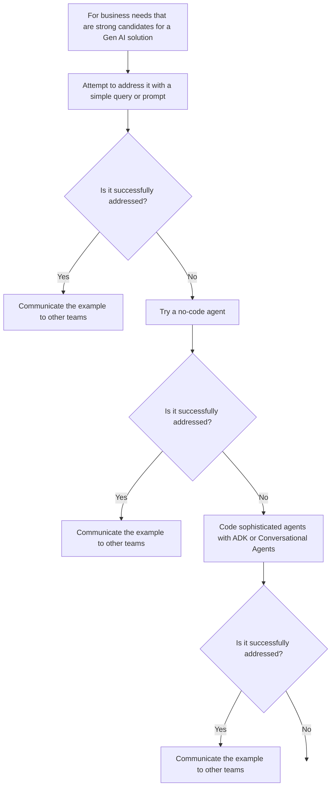
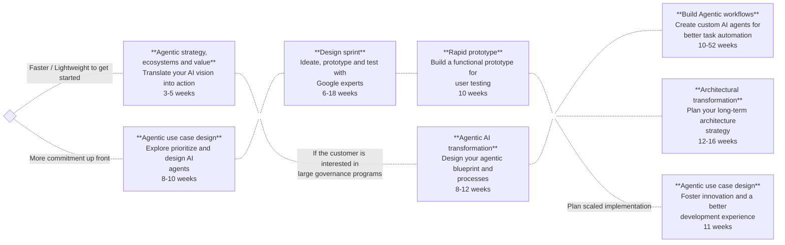

# Develop starter no-code agents

## **Start simple. Get more complex as needed.**

It may not be initially clear where your customer might need to build out a more custom implementation to fulfil their desired solution offerings. However, a big advantage of Gemini Enterprise is that it enables them to get going quickly.

Once they have identified some business needs that are strong candidates for an agentic solution, they can start simple, by attempting to address it with a query or prompt within the Gemini Enterprise built-in assistant. They can also utilize the various Tools and Data connectors that are available, or even set up some Notebooks through the integration with NotebookLM. If they achieve a successful result that can be replicated, they can communicate this example with other teams.

For any business needs that can't be resolved through a simple query, they can try building a simple agent through the Gemini Enterprise no-code Agent Designer. And only if the business needs are still not satisfied would they then move on to developing a more complex agent using the Agent Development Kit (ADK) or Conversational Agents.

The diagram below demonstrates the decision making process when designing a solution offering:

## **It’s likely that a mature agentic deployment will require a series of engagements**

Gemini Enterprise is a home for several solutions, however it is usually just one part of a wider, more comprehensive agentic deployment which consists of a series of engagements. Its important to understand how Gemini Enterprise fits into a bigger agentic strategy and transformation.

If your use case demands a fast and lightweight implementation you can get started with your agentic strategy, ecosystems and value, to translate your AI vision into action in a few weeks. If your use case demands more commitment up front you can spend longer on your Agentic use case design, to explore, prioritize and design AI agents. However, whichever route you choose there are further phases to developing a mature agentic deployment which do require the commitment of more time and resources and leads toward a planned scaled implementation across your organization and solution offering.

## **Agent and platform governance**

Establish governance by unifying app management and agent development with clear processes for access and integration.

Your customer can use the **agent governance checklist**to ensure they are meeting the necessary requirements.

*Click each tab to learn more.*

- **Agent lifecycle and management:**

  - **Agent Intake and Publishing**: Define a formal approval process (such as terms of approval, change management) for new agents and capabilities.

  - **Agent Development and Versioning**: Standardize methodology for development, version control, and code changes.

  - Implement a process for depreciating and deleting agents.

  - **Monitoring and Performance**: Establish a mechanism to continuously monitor agent performance, including model usage (such as Flash, Pro) and key metrics (for example API Error Rate, API Latency).

- **Data security and governance:**

  - **Data Source Acquisition**: Define and manage data source credentials, authentication, and private connectivity; onboard new connections through a project or approval process.

  - **Data Governance and Quality**: Maintain a list of data sources mapped to agents.

  - Implement data quality scans, labeling and tagging, and sensitive data protection (SOP and DLP).

  - **Access Control (RBAC)**: Define and periodically review permissions.

  - Use Role-Based Access Control (RBAC) to manage access to agents, data sources, and connectors.

  - **Encryption and Key Management**: Set up proper encryption and key management.

  - Define if Google or Customer Managed Encryption Keys (CMEK) are required.

- **Compliance and ethical guardrails:**

  - **Audit and Traceability**: Define a process for auditing data access and agent activity.

  - Log all critical agent activity for audit purposes.

  - **Licensing**: Ensure proper licensing is defined and purchased based on groups and regional requirements.

  - **Prompt Compliance**: Implement guardrails (such as CUDO prompt compliance) and maintain oversight of agent behavior to prevent misuse.

## Create a starter agent using Gemini Enterprise's no-code Agent Designer

It's  important for your customer to understand how easy it is to create a starter agent using Gemini Enterprise's no-code Agent Designer.

Expand the left nav and navigate to the **Agent** tab.

Use the **Create Agent** option on the expanded panel, or the **View all agents** option to get the Create Agent option.

The gallery contains premade agents from Google, agents made available by a customers company, and any agents created using Agent Designer.

To access Agent Designer, click “Create Agent.”

Fill out basic agent details like Name, Goal, and Instructions.

- The **Name** should give a clear indication of the purpose of the agent.
- The **Goal** should breifly describe the general task that the agent will perform.
- And the **Instructions** should provide a step-by-step process for the agent to follow to fulfil its task.

In this example it is a New summarizer agent whose goal is to summarize this weeks AI news, with instructions to:

1. Search Google for recent news in AI published within the last week.
2. Understand what topics are trending in the US and Europe.
3. Summarize the findings.
4. Present them to me in two tables, one for the US and one for Europe

The instructions can be enhanced by clicking, “Help me write”.

Review the updated instructions and save the agent.

Once the agent is created, click, “Start Chat” to run it.

Note that the agent has followed the instructions.

To edit the agent, find the agent in the Agent tab.

Expose employees to any Agents that have built through ADK or other frameworks through the Agent tab.

> [!NOTE]
> When writing instructions for agents, use best practice prompting strategies.
>
> You can find information on writing instructions for agents in the documentation here:
> [Prompting design strategies](https://cloud.google.com/vertex-ai/generative-ai/docs/learn/prompts/prompt-design-strategies)
