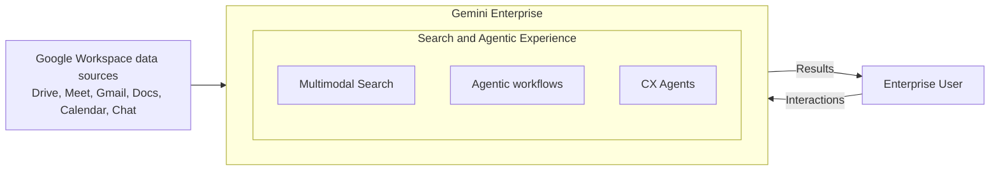
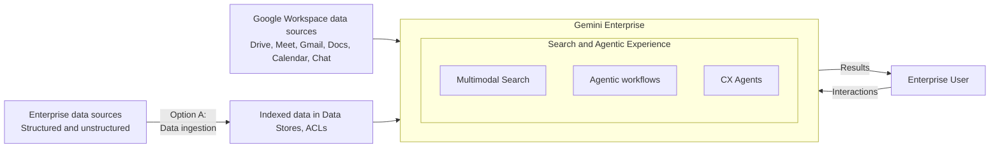
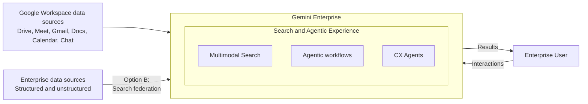
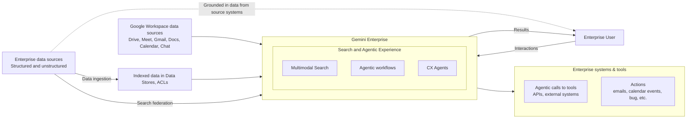

# Architecture Overview

Let's begin by introducing Gemini Enterprise.

**Video Link:** [Introducing Gemini Enterprise (in less than a minute)](https://www.youtube.com/watch?v=GI9wJLvHBdc)

>Sundar Pichai, CEO, Google and Alphabet, opens the keynote for Google Cloud's event on October 9, 2025. Watch the full 50-minute replay here → <https://www.youtube.com/live/uLHF9T1SLrU> In the full show, you'll hear from Google Cloud CEO Thomas Kurian, see Gemini Enterprise in action with live demos from product leaders, and hear how customers around the world are transforming their businesses.

## Enterprise data sources

At its core, the Gemini Enterprise architecture is designed to seamlessly connect you with information from your organization or the web.

When you **submit a prompt** through the unified chat interface, **Gemini Enterprise retrieves relevant information** from your connected enterprise systems to generate a grounded result.

* **Organizations using Google Workspace**
  * For organizations that use Google Workspace, you can easily add Google Drive, Gmail, Calendar, and other apps as **data stores**.
* **Organizations using other productivity suites**
  * For organizations using other productivity suites, **third-party connectors** are available for many common sources, including SharePoint, Jira, Box.com, Dropbox, and more.

Accessing data with ingestion or federation

When architecting Gemini Enterprise access to enterprise data stored in **third-party systems** (not on Google Cloud or in Google Workspace data stores), you may be asked to choose between two primary data retrieval patterns, namely, **Ingestion**or **Federation**.

### Data Ingestion

With data Ingestion, your data, along with its associated **Access Control Lists**(ACLs), is actively pulled from the **source systems** and securely indexed into dedicated **Data Stores** within Google Cloud.

Because the **data is stored and processed** natively within the **Google Cloud perimeter**, this method typically yields the **fastest query latency**. The system respects the **ingested ACLs** at query time, ensuring **users only receive answers** generated from documents they have explicit **permission to view**.

### Search Federation

Search Federation, also known as **real-time or live federation**, leaves your data entirely within its **original source system**.

Instead of indexing the data beforehand, Gemini Enterprise **translates the user's prompt into a live query** against the external system's API. The external system **processes the query**, **enforces access controls** natively, and **returns the relevant data** back to Gemini Enterprise to ground the final response.

This **zero-copy architecture** is highly advantageous for organizations dealing with strictly **regulated**, highly **sensitive**, or rapidly **changing data** where creating a **secondary****index**is not permissible. It also avoids the duplicate **storage costs** and managing additionalperiodic **data ingestion complexities**.

## Taking actions

The capabilities of **Gemini Enterprise** extend beyond retrieving and summarizing information as it is also **designed to execute tasks**.

Some **Google-provided data stores** allow you to enable actions, which allow Gemini Enterprise to make **OAuth-authenticated calls to external tools and APIs**on a user’s behalf.

You can ask Gemini to:

* draft and send emails,
* schedule calendar events, or
* update bug tickets in third-party tracking systems directly from the chat interface.

## Summary

Understanding this flow from the user interface, through the reasoning engine, down to the ingested or federated data stores, and back out through agentic actions, forms the blueprint for deploying Gemini Enterprise.

With this architectural foundation established, further modules will explore the specific networking, identity, and security configurations required to bring this ecosystem to life safely and effectively.
