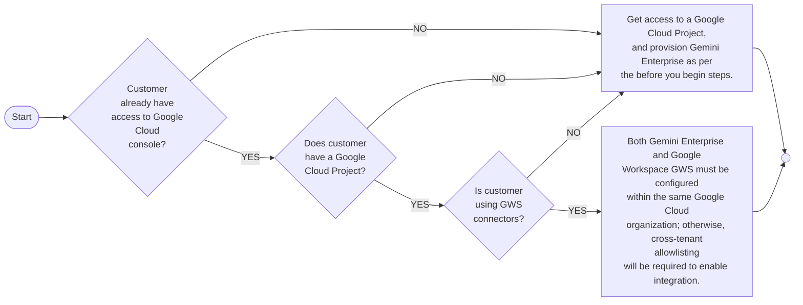
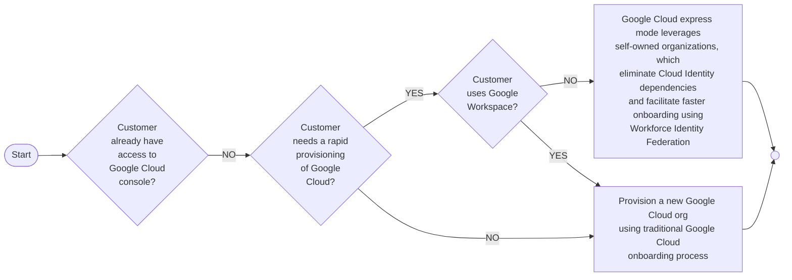

# Provisioning

> ## The Discovery Engine API
>
> * Before users can interact with Gemini Enterprise, the **underlying infrastructure** must be **properly provisioned within Google Cloud**.
> * The core engine driving **Gemini Enterprise's search and agentic capabilities** is the **Discovery Engine API**.

## IAM permissions

To configure the application, data stores, and actions securely, administrators must be assigned specific Identity and Access Management (IAM) [roles](https://docs.cloud.google.com/iam/docs/roles-permissions/discoveryengine#discoveryengine.admin).

The provisioning administrator requires the Discovery Engine Admin role, the OAuth Config Editor role to properly configure the consent screen for actions, and the Service Usage Admin role to enable any necessary underlying APIs.

For end-users to access the Gemini Enterprise app, they must be granted the Discovery Engine User role.

## Provisioning

The provisioning pathway for Gemini Enterprise depends on your organization's existing infrastructure: particularly whether you are an existing Google Cloud customer and whether you utilize Google Workspace.

### Organizations already using Google Cloud

If an organization already uses Google Cloud and intends to connect Google Workspace data, such as Gmail or Google Drive, both **Gemini Enterprise and Google Workspace** must reside within the same **Google Cloud Organization**.

Adhering to this '**Google Workspace Connector Rule**' is crucial. Failing to align them in the same organization requires complex cross-tenant allowlisting to enable integration.

### Organizations currently not using Google Cloud

For organizations that do not currently have a Google Cloud environment, Google offers **tailored onboarding paths**.

#### Google Cloud Express Mode

[Google Cloud express mode](https://cloud.google.com/resources/cloud-express-faqs) provides a fast track for net-new Google Cloud customers who do not use Google Workspace.

This streamlined approach leverages self-owned organizations and utilizes **Workforce Identity Federation**, eliminating the standard dependencies on Cloud Identity and significantly accelerating the onboarding process.

#### Fallback Onboarding Path

However, if these **rapid provisioning tools are unavailable**, or if a net-new customer plans to **integrate Google Workspace data**, the organization must rely on the **traditional fallback path**, which involves the standard **Google Cloud organization onboarding process**.

## Summary

Successfully deploying Gemini Enterprise relies on enabling the underlying. By assigning the correct IAM roles such as Discovery Engine Admin, OAuth Config Editor, and Service Usage Admin, organizations can enable the necessary APIs and establish a secure, foundational environment ready to connect users with intelligent, agentic capabilities.
