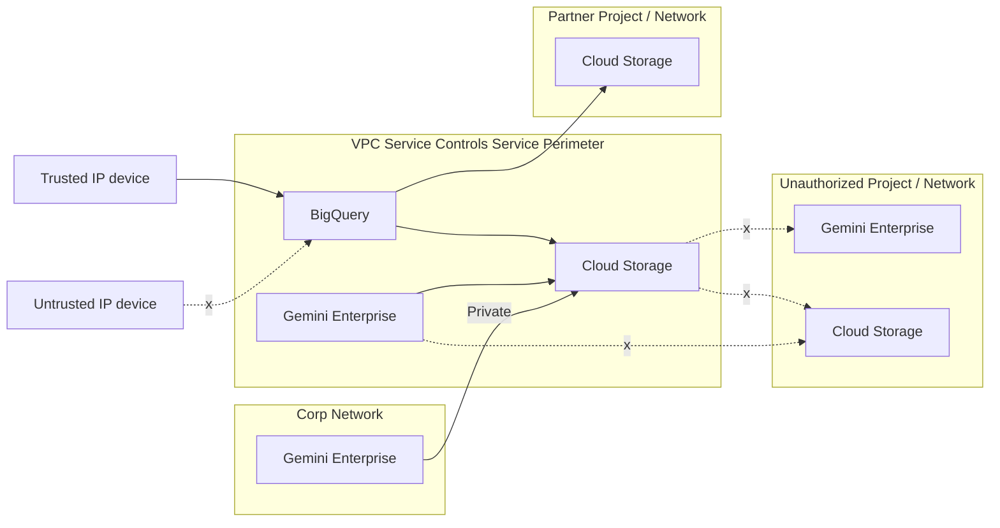
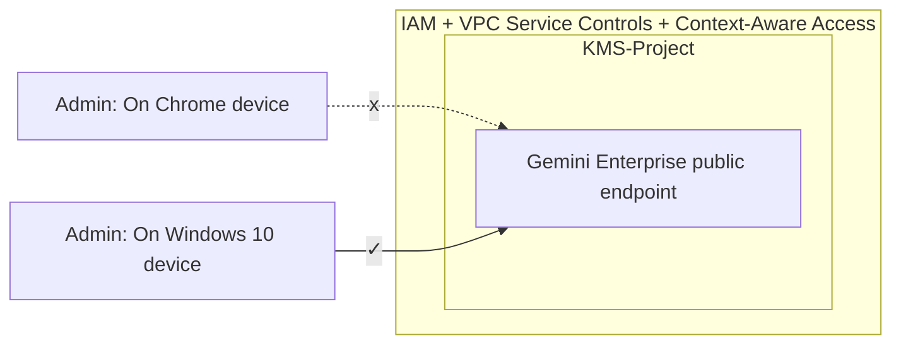
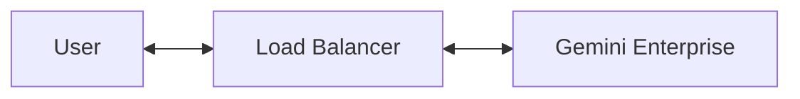

# Networking

Once the environment is provisioned and identities are established, securing the network perimeter and optimizing traffic flows become the next critical focus.

## Virtual Private Service Control

Gemini Enterprise can be integrated with Virtual Private Cloud Service Controls (VPC-SC).

This powerful security feature allows administrators to draw a **virtual service perimeter around managed cloud services**, including Cloud Storage, BigQuery, and Gemini Enterprise itself.

This perimeter acts as a secure boundary that **isolates your data and AI interactions** from unauthorized networks, preventing data exfiltration.

For example, consider a financial institution using Gemini Enterprise to summarize sensitive revenue data stored in BigQuery.

1. If a bad actor manages to compromise an **employee's login credentials** and attempts to query the **Gemini Enterprise interface** or the underlying **BigQuery data** from an **unauthorized external network**, **VPC-SC** will block the request.

2. Even with the **correct passwords**, the **virtual perimeter** ensures that the **Al service and its data** can only be reached from **trusted, explicitly managed** corporate networks or devices.

### Context-Aware Access

Complementing this perimeter is Context-Aware Access, which introduces a Zero Trust security layer to your deployment.

Rather than relying solely on traditional user credentials, Context-Aware Access dynamically **evaluates a user's real-time context**, such as their **device health**, **geographic location**, and **current** **network state**, ***before*** granting or denying access to resources.

When combined with **VPC Service Controls** and Identity and **Access Management**, this ensures that only validated users on trusted devices can interact with your enterprise AI environment.

## Network consideration

Generative AI models require more processing time than traditional web applications, often exceeding **standard 30-second network timeouts**.To prevent corporate **load balancers** and **firewalls** from prematurely **dropping** these **connections**, network engineers must **adapt their infrastructure**.

Key strategies include:

* Increasing backend timeouts to 3-5 minutes for standard queries.
* Leveraging streaming APIs to keep connections active with chunked responses.
* Utilizing asynchronous polling for extensive, long-running background tasks.

### Summary

A well-architected Gemini Enterprise deployment hinges on thoughtful networking considerations and adjustments to help optimize, secure and make the application more accessible.
