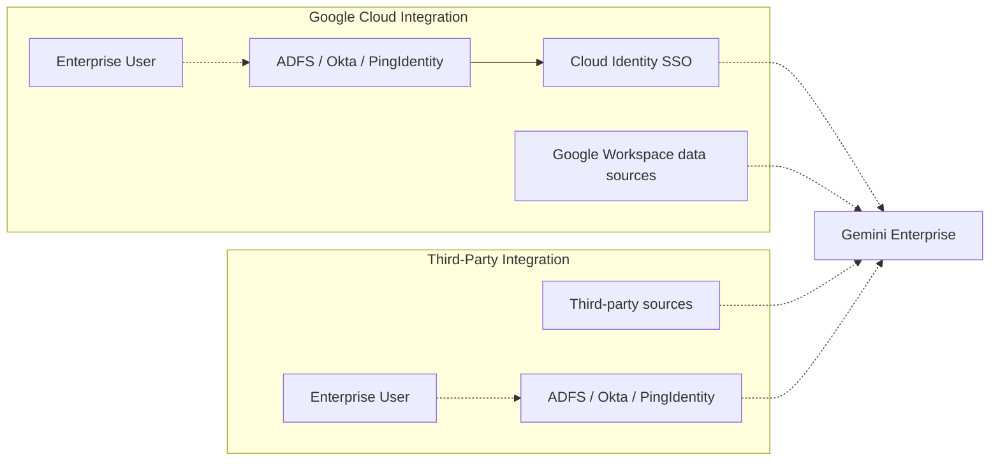
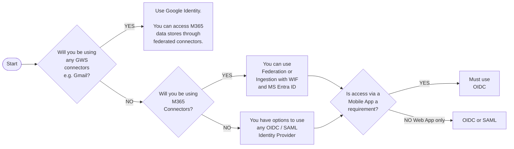
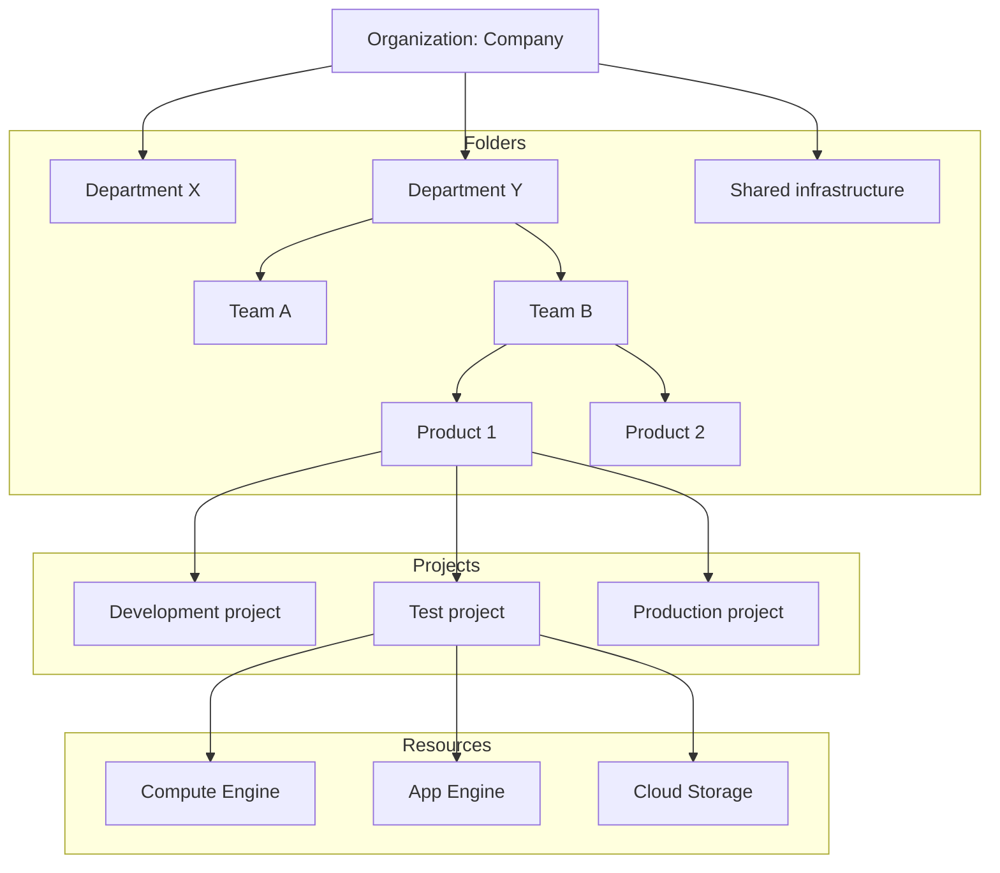

# User Identity and Access Management

With the network perimeter secured, the next critical decision is to select the **correct identity provider** for your deployment.

Your chosen **identity** **configuration** directly dictates how **end**-**users** **authenticate** and how the **AI system enforces** **document-level permissions**. The architecture demands a specific **identity strategy** depending on the **data stores** your organization plans to utilize.

## Identity providers

Let's explore the requirements for choosing an Identity Provider for a Gemini Enterprise deployment based on its integration needs.

### Google Identity

If your deployment integrates with any **Google Workspace applications**, such as Gmail or Google Drive, you are strictly required to use Google Identity.

If you need to connect to M365 connectors as well, you can do so using federated connectors.

### third-party Identity Provider

If you are exclusively connecting Gemini Enterprise to third-party data sources and your organization already utilizes a third-party Identity Provider, such as Microsoft Entra ID, Active Directory Federation Services (AD FS), Okta, or Ping Identity, you are not forced to migrate to Google Identity.

Instead, you can leverage **Workforce Identity Federation**. Thisallows your users to authenticate using their existing corporate credentials via SAML 2.0 or OIDC.

> There is one more strict case to be aware of within this third-party pathway:
>
> ## Microsoft 365 ingestion connectors
>
> If you plan to use Microsoft 365 ingestion connectors, you must specifically use Workforce Identity Federation tied to Microsoft Entra ID to properly map and enforce Microsoft's access control models.
>
> ## Workforce Identity Federation for identity
>
> If using Workforce Identity Federation for identity, and your deployment architecture requires users to access Gemini Enterprise via a mobile application, OIDC must be utilized as the authentication protocol, whereas SAML 2.0 is highly recommended if access is restricted solely to a web application.

## Access boundaries

Administrators must carefully manage access boundaries within Google Cloud.

### Access via Project Role

If a user is granted the **Discovery Engine User** role on a Google Cloud Project, they gain access to all Gemini Enterprise applications housed within that project.

### Deployment Strategy for Isolation

If separate applications are required for different departments, architects should deploy them into **different Google Cloud Projects** to isolate business units or security tiers.

## IAM roles and responsibilities

To effectively manage and secure a Gemini Enterprise deployment, organizations should assign Identity and Access Management (IAM) roles according to user tasks.

> ### Role: Security/IAM Admin
>
> **IAM Role:** Org Admin
>
> **Tasks:**
>
> * Grant IAM permissions to Gemini Enterprise Admins
> * Grant IAM permissions to Gemini Enterprise end users
> * Most customers use this role with automation to grant IAM roles
> * Terraform is supported for IAM grants
> * Workforce Identity Federation configuration

At the highest level, the Security or IAM Administrator operates with the Organization Admin role.

This administrator is responsible for **configuring Workforce Identity Federation** and **granting the necessary IAM permissions** to Gemini Enterprise administrators and user groups, often utilizing **automation tools** like Terraform for scalable rollouts.

> ### Role: Systems Administrator
>
> **IAM Role:** Gemini Enterprise Admin
>
> **Tasks:**
>
> * Creation of connectors
> * Configure Gemini Enterprise UI
> * Create actions
> * Create Gemini Enterprise apps
> * Building custom agents requires more permissions like Gemini Enterprise Agent Platform users

Once the foundation is laid, an engineer dedicated to the Gemini Enterprise deployment can take over the **application configuration** using the Discovery Engine Admin role. This role provides the permissions necessary to **create** **data connectors**, **configure the Gemini Enterprise user interface**, **establish agentic actions**, and **build the core applications**.

It is important to note that **deploying agents will require additional permissions**, such as the [Agent Platform User](https://docs.cloud.google.com/iam/docs/roles-permissions/aiplatform#aiplatform.user) role to deploy agents to Agent Runtime.

> ### Role: End user
>
> **IAM Role:** Gemini Enterprise User
>
> **Tasks:**
>
> * Access Gemini Enterprise
> * Search across all connectors*
> * Use pre-created agents
> * Use actions defined by Admin*
>
> *\* The user needs IAM/ACL permissions to the apps*

Finally, the **general workforce** interacting with the platform operates as **End Users** with the [Gemini Enterprise User](https://docs.cloud.google.com/gemini/enterprise/docs/access-control#discoveryengine.agentspaceUser) role. This role provides access to the **deployed Gemini Enterprise app**.

With this role, users can **execute searches across all authorized connectors**, **interact with pre-created agents**, and **utilize actions defined by the administrator**, provided they have the correct underlying permissions for those specific applications and data sources.

## Summary

A secure Gemini Enterprise deployment relies on a strong identity and access management foundation. Organizations can establish safe, permission-aware access for their entire workforce by selecting the appropriate identity provider—Google Identity or Workforce Identity Federation—and assigning specific IAM roles like Discovery Engine Admin and User.
