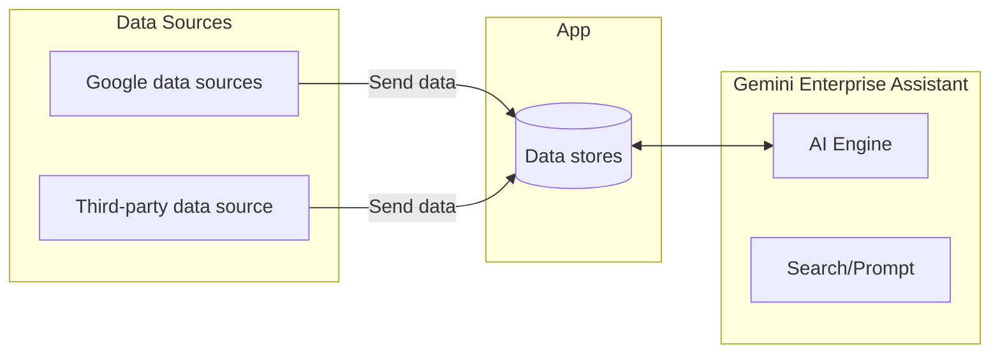
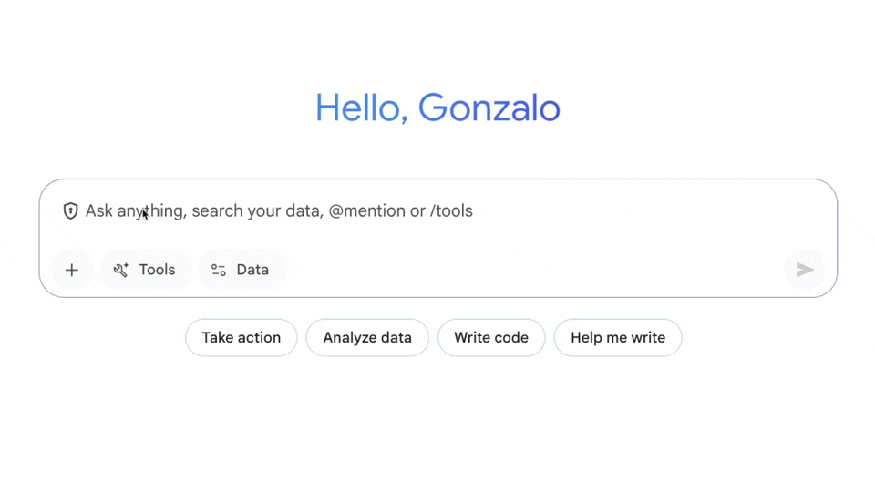
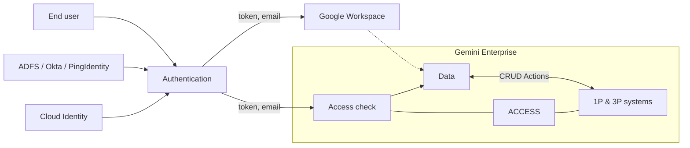
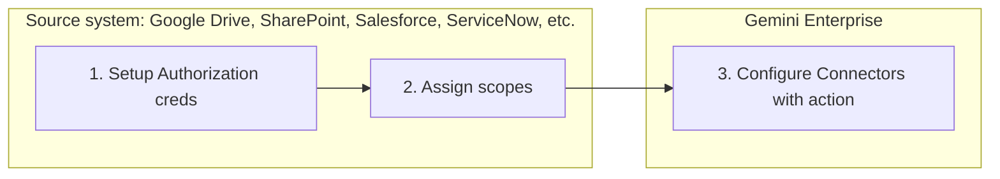
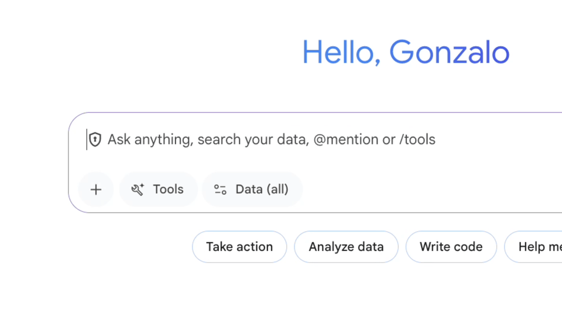

# Data Stores

Data Stores grant Gemini Enterprise access to generate responses grounded in your enterprise data and take appropriate actions.

You may also encounter the term '**Connectors**', which serve as the active transport mechanism, securely ingesting or querying data. Once data is retrieved, it is housed within a **Data Store**– a secure, centralized, and highly structured AI-ready database. In practice, these terms are often used interchangeably.

* Connectors
  * A transport mechanism that securely gathers and transfers scattered corporate data for further processing and storage.
* Data Store
  * An organized, AI-ready vault where securely housed data is made searchable for the Gemini assistant.

Google provides a variety of pre-built data stores to popular first and third party systems.

View the latest list of third-party data stores, paying attention to the release stages of each, in the official Google Cloud documentation title: [Connect a third-party data source](https://docs.cloud.google.com/gemini/enterprise/docs/connectors/connect-third-party-data-source#connect_a_third-party_data_source_2).

---

## Connection mode

**Federated mode** connectors, also known as **real-time or zero-copy connectors**, leave the data strictly within its original source system.

In this mode, Gemini Enterprise translates the **user's prompt**, and **queries the external API live**.

This approach is highly favored by **information security teams** because **no proprietary data is copied into a secondary cloud** **index**, and **permissions are enforced** natively by the source system during the live query.

Federated mode also **offers turnkey onboarding**, **requires fewer OAuth scopes**, and **guarantees that the information retrieved is always one-hundred percent up-to-date**. The trade-off is that **query latency** can be **slower** and **variable**, as Gemini is entirely dependent on the response time and payload limits of the external system's API.

## Alternative integrations

If a pre-built connection is not available for a specific proprietary system, organizations have alternative integration strategies.

### MCP Server Approach

The preferred approach is utilizing an MCP server to access your application. Many popular applications support this open standard to connect to their data in a federated way.

By connecting directly to MCP servers, Gemini Enterprise dynamically queries specialized enterprise data in real-time, eliminating heavy ingestion workarounds and reducing the development effort required to build custom connections.

### Database Workaround

If the MCP server approach is not suitable for your deployment, administrators can employ a database workaround.

By utilizing standard enterprise Extract, Transform, Load (ETL) tools, data from the unsupported system can be pushed into a native Google Cloud database, such as BigQuery or Cloud Storage.

Once residing in Google Cloud, administrators can attach a native first-party connector to surface that data within Gemini Enterprise.

## Setup

Now let's explore setup.

* **The System Administrator's Role**
  * Begins by setting up the authentication credentials for your source systems. This ensures that Gemini Enterprise only accesses data with your explicit permission. Following that, they assign the specific scope for these connectors – defining precisely what data or actions can be accessed.
* **The Gemini Enterprise Administrator's Role**
  * Once those foundational security steps are complete, your Gemini Enterprise Administrator takes over to configure the connectors within Gemini Enterprise. This involves mapping fields, defining indexing rules, and ensuring the data flows seamlessly into your Gemini Enterprise environment.

## Deployment best practices

Deploying these connectors successfully requires rigorous testing and adherence to deployment best practices.

* Administrators should never assume a connector will work flawlessly out of the box, especially if that connector is not yet listed as Generally Available in the [third-party connectors documentation](https://docs.cloud.google.com/gemini/enterprise/docs/connectors/connect-third-party-data-source#connect_a_third-party_data_source_2).
* Instead, they must de-risk the deployment by conducting technical pre-flight checks to confirm all IAM permissions and access policies are correctly applied.
* When scaling, it is highly recommended to start small by mastering a single connector before introducing the complexity of multiple data streams.
* Finally, when initiating user testing, administrators must verify that the testers actually possess the required permissions within the source system; otherwise, testers may encounter missing data and falsely report that the Gemini integration is broken.

## Data + action

Some 1st party data stores feature agentic workflows when they are being set up.

For example

* **Google Calendar**

  A Google Calendar Data Store lets the AI read your meeting history, while a Calendar Action lets it schedul new events.

* **Gmail**

  The Data Store reads past emails for context, and the Action drafts and sends new replies.

### Human-in-the-loop approval

Google's architecture ensures **security and accuracy** by enforcing a strict 'human-in-the-loop' approach for these **agentic capabilities**. When a **user prompts Gemini Enterprise** to create a **calendar event or compose an email**, the system does not execute the action unchecked in the background. Instead, the following takes place:

1. The assistant generates a structured draft and presents it to the user directly within the chat interface.
2. The user is provided the opportunity to review the content and modify fields as necessary.
3. The user explicitly clicks to authorize the final execution.

This **crucial validation step** **guarantees** that all AI-generated actions remain entirely under **human supervision** before impacting external systems.

## Summary

Connectors and Data Stores serve as the critical infrastructure that transforms Gemini Enterprise into a highly contextualized reasoning engine for your organization. We recommend taking a proactive, phased approach to ensure a smooth and successful rollout with data connectors.

You’ll minimize risks and set your project up for immediate success by validating capabilities upfront, conducting technical pre-flight checks to confirm all IAM permissions and access policies are correctly applied, and mastering one connector before scaling.
