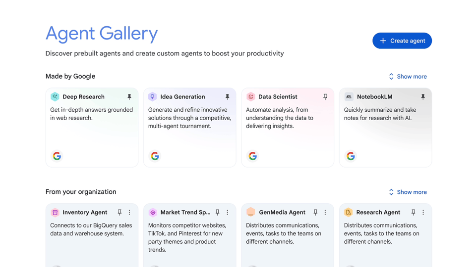
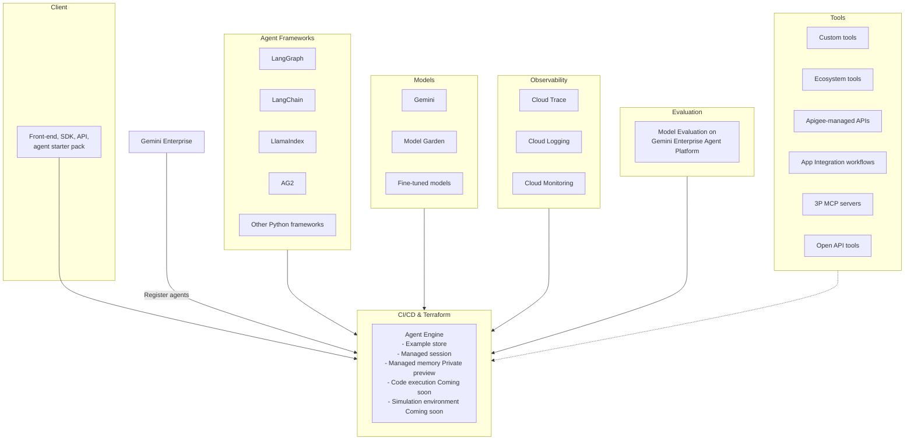
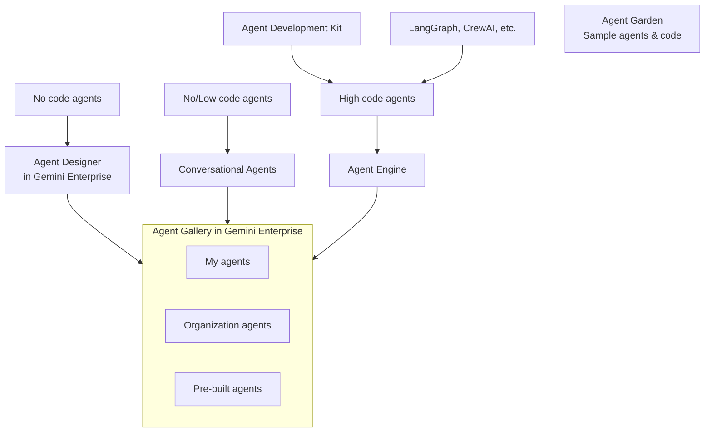
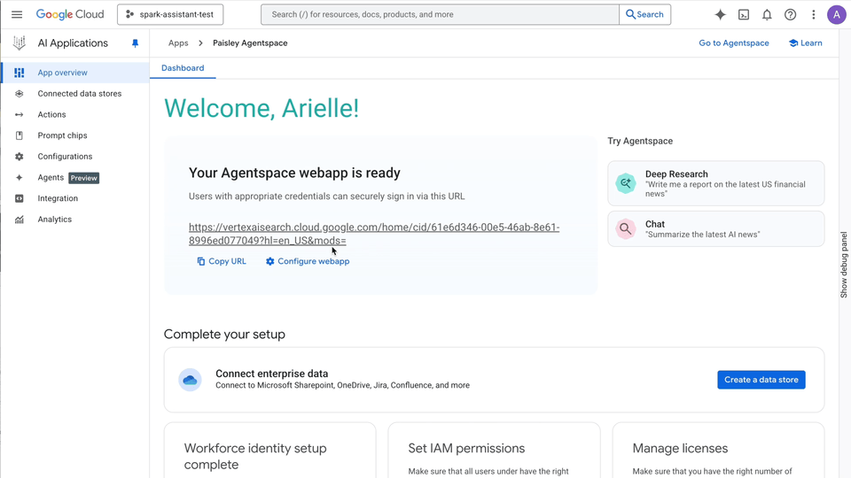

# Agents

Gemini Enterprise provides a foundation for Agents, which are **active digital workers** capable of executing multi-step workflows across your enterprise systems on your behalf.

## The shift from chatbots to agents

An agent moves beyond simply answering questions. It is characterized by its ability to:

* **Reason and Act**
  
  Use Gemini's reasoning to break down a complex task, determine the needed data, analyze it, and automatically determine the next steps to take.
* **Use Tools**  

  Seamlessly connect to your enterprise systems via APIs, connectors, or MCP servers to access internal databases, run code, or trigger external application actions.
* **Fulfill a Specific Role**  

  Agents are purposefully designed for distinct business functions, such as a 'Revenue Cycle Advisor Agent' or an 'IT Helpdesk Agent.'

## The agent development spectrum

Gemini Enterprise provides a platform that supports agent creation for every technical skill level:

### Agent Designer

Non-technical business users can create robust, customized agents using only natural language prompts through the Agent Designer interface.

This approach accelerates content creation and everyday workflow automation directly from the end users.

### Agent Studio

You can build conversational AI agents using guided visual workflows, defining specific paths and guardrails for customer experience (CX) bots and internal support.

### Agent Engine

Agent Engine provides a robust, managed runtime environment specifically designed to host, execute, and govern high-code agents.

It acts as an orchestration layer, supporting agents built with both Google's and third-party models.

Within the Agent Engine, developers can leverage features like managed session state, managed memory, and a suite of over 30 pre-built tools and actions.

To build these systems, you can utilize Google's Agent Development Kit (ADK) alongside popular open-source frameworks such as LangChain, LangGraph, CrewAI, and LlamaIndex.

Furthermore, the Agent Engine integrates with CI/CD pipelines and provides observability through Cloud Logging, Cloud Monitoring, and Cloud Trace, ensuring that even the most complex multi-agent systems remain reliable, transparent, and easy to maintain.

## Types of agents in Gemini Enterprise

## Centralized governance and discovery

Managing an array of digital workers requires **enterprise-grade oversight**. Administrators gain centralized visibility and control, ensuring every agent operates under security guidelines and AI Protection guardrails.

For the **end-user**, these agents are easily discoverable. Users can **type @ in the search bar** to call an agent into their **current conversation**, or **browse the dedicated Agent Gallery**, which categorizes digital workers into:

* My Agents
* Organisation Agents
* Pre-built Agents

## Enabling agent actions with OAuth

To enable agents to actively execute **workflows** like updating a **CRM record or sending an email**, Gemini Enterprise uses **OAuth**(Open Authorization).

OAuth is like a digital '**valet key**,' as it allows your agents to **securely interact with external systems** on your user’s behalf **without ever needing their actual password**.

### Granular Permissions

Administrators configure OAuth 'scopes' that limit what an agent can do. For example, an agent might be granted read-only access to analyze data, but exclude write access to a sensitive database, preventing it from altering records.

### User Consent

The first time an agent attempts an action, you receive a prompt to authorize the OAuth client, granting the agent permission using your identity credentials. That action grants the agent a “valet key” to carry actions on the user’s behalf.

### Human-in-the-Loop

Even with OAuth access, agents do not blindly execute actions. When an agent needs to carry an action on the user’s behalf like send an email, file a Jira ticket or create a calendar invite, the agent will present the suggested action and will only carry it upon the users’ approval.

## Configuring an OAuth client

Configuring an OAuth client is done through Google Auth Platform, where you create an OAuth Client.

1. **Configure the Application**
   Navigate to the **Google Auth Platform,** register an application name and create an OAuth Client.
2. **Define Granular Permissions**
   Administrators configure explicit OAuth 'scopes' that limit what an agent can do. For example, an agent might be granted read-only access to analyze data, but denied write access to prevent it from altering records.
3. **Create OAuth Client Credentials**
   Generate an OAuth 2.0 Client ID and Client Secret, which act as cryptographic keys that uniquely identify the Gemini application to the external API.
4. **Configure the Action**
   Input this Client ID and Secret into the agent workflow to complete the secure bridge between the two platforms.

## Summary

Agents are active digital workers from Gemini Enterprise that execute multi-step workflows across enterprise systems. They move beyond simple chatbots by using reasoning and tools to perform complex, specific business functions.

All agents operate under centralized governance. Their ability to execute actions is securely enabled by OAuth, which ensures granular permissions, user consent, and maintains a 'Human-in-the-Loop' for final action approval.
