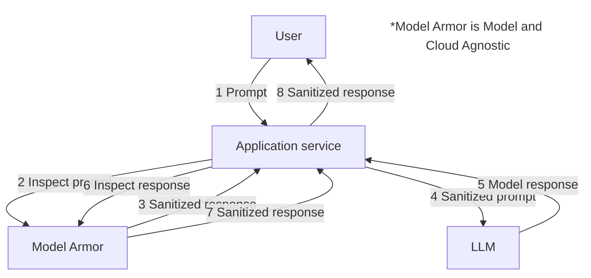

# Model Armor

With great capability comes the need for serious security.

When deploying a generative AI solution, organizations must ensure that the AI does not inadvertently **leak sensitive data**, **generate inappropriate responses**, or **fall victim to malicious user prompts**.

To address these risks, administrators should implement **Model Armor**, a robust security feature that acts as a protective shield around your generative AI models.

Model Armor works by sitting squarely between the end-user and the Large Language Model (LLM). It continuously inspects both the ***input*** (the user's prompt) and the ***output*** (the model's generated response), sanitizing the data in transit before it reaches its destination.

To provide comprehensive protection, Model Armor utilizes a series of customizable filters, including:

* Sensitive Data Protection
  * Detects and redacts Personally Identifiable Information (PII) or confidential business data to prevent accidental disclosure.
* Prompt Injection and Jailbreak Detection
  * Neutralizes attempts by users to manipulate AI instructions or bypass established safety constraints.
* Malicious URL Detection
  * Actively blocks links to malware, phishing, or harmful sites.
* Content Safety Filters
  * A suite of filters designed to block hate speech, dangerous content, sexually explicit material, and harassment.

## Decoupling templates and adjusting thresholds

Model Armor allows administrators to set specific thresholds, such as **High**, **Moderate**, or **Low**, which dictate the **confidence level required to flag a violation**.

A **High threshold** is recommended for production environments as it minimizes false positives and ensures uninterrupted user interactions.

While a **Low threshold** is highly restrictive and should be used with caution.

### Decouple templates

Crucially, administrators can and should decouple the rules applied to inputs from the rules applied to outputs using the following distinct templates:

> ### Input vs Output Templates
>
> * **Input template**: Should be focused on preventing malicious user behavior. This includes catching prompt injections, jailbreak attempts, and preventing users from uploading highly sensitive data into the prompt.
> * **Output template**: Should be focused on the model's behavior, ensuring the AI does not leak sensitive data, generate off-brand or harmful content, or return malicious URLs.

## Deployment best practices

### Initiate in 'Inspect Only' Mode

When rolling out Model Armor, it is highly recommended to start in '**Inspect Only**' mode. This allows administrators to observe potential block rates and validate the efficacy of their filters without actively disrupting the user experience.

### Disable Prompt Injection and Jailbreak Detection

To significantly reduce false positives, administrators should disable **Prompt Injection** and **Jailbreak detection on the response (output) template**.

Because these specific types of attacks originate entirely from the user's prompt, filtering for them in the model's response is unnecessary and often leads to valid answers being incorrectly blocked.

### Floor settings

Finally, organizations can establish a baseline security posture by using '[Floor Setting Conformance](https://docs.cloud.google.com/model-armor/configure-floor-settings).'

This allows security teams to dictate minimum safety thresholds globally at the **Organization**, **Folder**, or **Project** level, ensuring that no individual Gemini application can bypass the company's foundational safety requirements.

> ### Baseline Security
>
> Dictate the minimum safety thresholds globally at the organization, folder, or project level. Local settings are always applied.

> **Note**: There is an important nuance to this feature: local settings are always applied alongside the organizational baseline.

This means that while an **individual application administrator** cannot lower or bypass the mandated global safety floor (e.g., changing a required '**Medium**' hate speech filter to '**Off**'), they are still empowered to apply ***stricter* local settings**.

For instance, they can increase the threshold to '**High**' for their specific app or introduce **custom dictionary filters**. Gemini Enterprise evaluates both the **global floor and the local configuration**, enforcing the most restrictive ruleset. This guarantees **corporate compliance** while preserving the flexibility needed for **app-specific safety tuning**.

## Summary

Model Armor is a robust security feature that protects generative AI by inspecting and sanitizing both the user's input prompt and the model's output. It uses customizable filters for sensitive data, prompt injection, and content safety to prevent data leaks and harmful content. Administrators can set rules and thresholds, ensuring local settings comply with a global security floor but can be made stricter.
