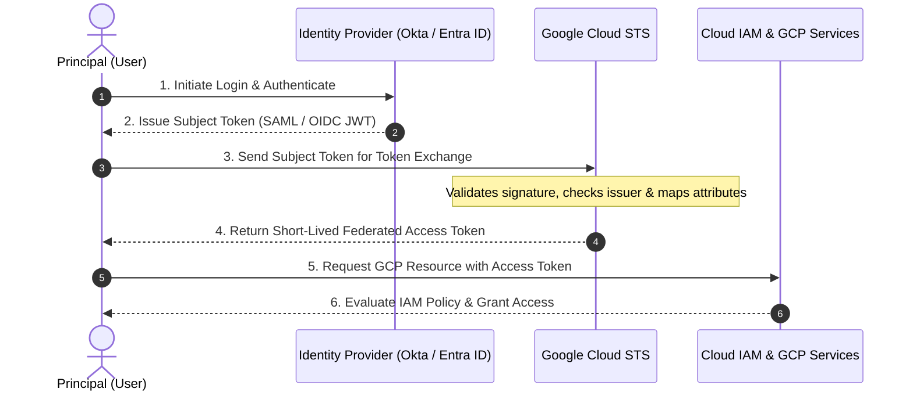

# The Architecture of Federation

## Learning objectives

By the end of this lesson, you will be able to:

- Deconstruct the Token Exchange flow into its component steps.
- Define the role of the Security Token Service (STS) in the Google Cloud IAM ecosystem.
- Distinguish between the Subject Token (Foreign Currency) and the Access Token (Local Currency).

## The Concept: The Currency Exchange

In the previous lesson, you decided to let GlobalTech's partners bring their own identities. But Google Cloud doesn't translate to Okta natively, and Okta doesn't translate to "Google IAM" natively. They function with different languages and use different currencies.

To bridge this gap, Workforce Identity Federation relies on a Security Token Service (STS).

### **Analogy**

Imagine you are travelling to a foreign country. You have Dollars (your external identity), but the local vending machines only accept Euros (Google IAM permissions).

- You go to a Currency Exchange Booth (Google STS).
- You prove your Dollars are real.
- The booth gives you Euros.
- You use the Euros to buy a snack.

In WIF, this process is technically known as Token Exchange.

### **The Actors (the cast of characters)**

Before you review the workflow, let's define the pieces involved:

- **The Principal (User)** - The external contractor trying to get in.
- **The IdP (Identity Provider)** - The external system (Okta, Entra ID and others) that vouches for the user.
- **The Subject Token** - The digital ID card issued by the IdP (usually a SAML Assertion or OIDC ID Token). This is the "Foreign Currency."
- **Google STS (Security Token Service)** - The Google service that validates the Subject Token.
- **The Access Token** - The short-lived Google credential used to access resources. This is the "Local Currency."

### **The Workflow: Tracing the packet**

Let's trace exactly what happens when a PartnerCorp developer tries to log in.

### Step 1: Authentication (External)

The user initiates a login. They are redirected to their own IdP (such as Okta). They enter their username and password there.

- Google Cloud is not involved yet.

### Step 2: Issuance (The Subject Token)

If the password is correct, Okta generates a **Subject Token**.

- **What is it?** A signed block of data (SAML XML or OIDC JSON).
- **What does it say?** "This is John Doe. He is in the 'Dev' group. I (Okta) verify this."

### Step 3: The Exchange (The STS Handshake)

The user's browser (or CLI) sends this Subject Token to Google's **STS Endpoint**.

- **The Request**: "Here is a token from Okta. Please give me a Google token."
- **The Verification**: Google checks its configuration:
  - Do I trust this IdP? (Yes, you configured the Provider).
  - Is the signature valid? (Yes, it matches the certificate on file).
  - Is the token expired? (No).

### Step 4: Finalization (The Access Token)

If verification passes, Google STS returns a **Federated Access Token**.

- This token acts like a standard Google Service Account token.
- It contains the mapped attributes (for example: **department=dev**).

### Step 5: Authorization (IAM Check)

The user presents the Federated Access Token to the Google Cloud API (for example: "List Storage Buckets").

- **Cloud IAM checks**: "Does the principal with **department=dev** have permission to **storage.buckets.list**?"
- **Result**: Access Granted or Denied.

## Visualizing the Flow

Review the diagram below to cement the "Exchange" concept.

## Deep dive: The "Trust" configuration

You might be asking: Why does Google STS trust the token in Step 4?

This is established during the **Configuration Phase** (which you will learn about later). When you set up WIF, you perform a one-time exchange of secrets or public keys:

- **If using OIDC**: You tell Google the IdP's **Issuer URL** (for example `https://dev-123.okta.com`). Google effectively "calls" that URL to ask for the public keys (JWKS).
- **If using SAML**: You upload the IdP's **Metadata XML** to Google. This contains the public key needed to verify the IdP's signature.

If the Subject Token isn't signed by the private key corresponding to that public key, Google STS rejects the exchange immediately.

## Summary

You now know how the exchange happens, but there are two main languages used for the "Subject Token": **SAML** and **OIDC**.

In the next lesson, you will compare these two protocols. Which one should you choose for GlobalTech? Does it matter if your partner uses Active Directory or a custom web app? You will find out.
