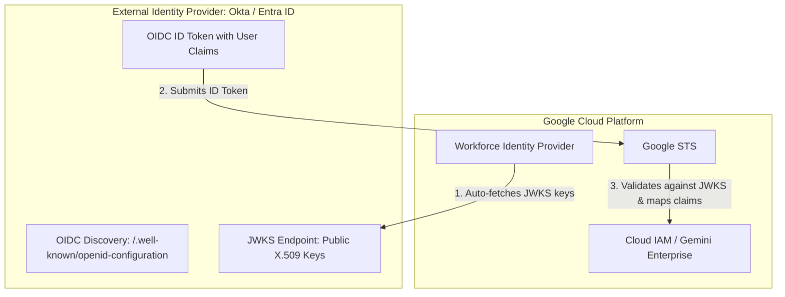

# Connect an IdP (OIDC)

## Learning objectives

By the end of this lesson, you will be able to:

- Configure an OIDC Provider to trust a modern identity source (Okta).
- Differentiate between the Issuer URI (The Source) and the Client ID (The Audience).
- Diagnose the common "Issuer Mismatch" error caused by URL syntax nuances.

## Back to the Scenario: The "PartnerCorp" Connection

You successfully created a pool in the previous lesson. Now let’s grant access to the **500 Developers from PartnerCorp**.

They use **Okta**. You have recommended that they connect with **OpenID Connect (OIDC)**.

To set this up, you need to:

- Ensure you have created the Workforce Pool (shown in the previous lesson) and have its **Workforce Pool ID**.
- Determine a **Workforce Provider ID** that you will use. The Provider ID can have lowercase letters, digits, or hyphens, and must be at least 4 characters long, for example `partnercorp-devs-oidc`
- To configure this application, the Identity Provider owner will need you to provide a **Redirect URL**. With the two IDs described above, you can construct a URL in this format, which you can provide to the PartnerCorp Admin:

```bash
https://auth.cloud.google/signin-callback/locations/global/workforcePools/WORKFORCE_POOL_ID/providers/WORKFORCE_PROVIDER_ID
```

You, then ask them for a few specific strings of text:

1. **Issuer URL**: The address of their Okta instance. For example: `https://partnercorp.okta.com`
2. **Client ID**: The ID of the application they created for you in their Okta portal.
3. **Client Secret**: a client secret associated with that Client ID.

## How OIDC "Trust" works (the invisible handshake)

Unlike SAML, where you manually upload a certificate, OIDC is dynamic.

1. **You tell Google**: "Trust tokens from `https://partnercorp.okta.com`"
2. **Google asks**: "Okay, how do I verify their signature?"
3. **The Automation**: Google silently adds `/.well-known/openid-configuration` to the end of that URL, makes a request, and downloads the public keys (JWKS) automatically.
4. **The Benefit**: If PartnerCorp rotates their keys tomorrow, Google updates automatically, with **zero downtime**.

## Step-by-step: configuring the Provider

Let's open the Google Cloud Console and finish the job.

### Configuring an OIDC Identity Provider with Google Cloud WIF

1. **Register Application in IdP:** In Okta / Entra ID, create a new Web Application with OpenID Connect.
2. **Obtain Client Credentials:** Note the **Issuer URL** (e.g. `https://dev-12345.okta.com`), **Client ID**, and **Client Secret**.
3. **Enter Details in Google Cloud:** Paste the Issuer URL, Client ID, and Client Secret into the Google Cloud OIDC Provider configuration wizard.
4. **Set Redirect URI:** Copy the Google Cloud sign-in callback redirect URI and register it inside the IdP application settings.
5. **Map Claims:** Map `google.subject = assertion.sub` and custom attributes (e.g., `attribute.department = assertion.department`).
6. **Validate Sign-in:** Test user sign-in using the generated Workforce login URL.

### Troubleshooting: the "Issuer mismatch"

The most common error in OIDC federation is trivial but frustrating.

- **The Scenario**: You configure the Issuer as `https://oidc.partner.com` (no slash). The user logs in, but Google rejects it with: `Invalid Issuer`.
- **The Investigation**: You explore the decoded token (using a tool like `jwt.io`). inside, you notice: `"iss"`: `"https://oidc.partner.com/"`
- **The Verdict**: The token has a trailing slash. Your config does not. String comparison fails.
- **Fix**: Update your Google Provider config to include the slash.

## Summary

In the next lesson, you will configure a SAML Provider. You will discover that it involves a little more back-and-forth coordination than with OIDC.

## Architecture & Workflow Diagram


