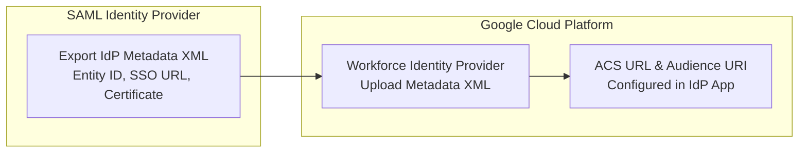

# Connect an IdP (SAML)

## Learning objectives

By the end of this lesson, you will be able to:

- Configure a SAML Provider within a Workforce Identity Pool.
- Interpret the function of the IdP Metadata XML file.
- Identify the critical "Audience URI" requirement to prevent common "Audience Mismatch" errors.

## The Sub-Scenario: "Legacy Corp"

While you are setting up the system for PartnerCorp (Okta), the legal team calls.

GlobalTech has also acquired a small manufacturing firm called **Legacy Corp**.

- **Their Tech**: They use a legacy on-premises **Active Directory Federation Services (ADFS)** server.
- **The Constraint**: They cannot use OIDC. They must use **SAML**.
- **Your Task**: Add a second "Door" to your existing Pool to let these users in.

## To initiate the configuration

1. Ensure you have created the Workforce Pool and have the Workforce Pool ID.
2. Determine a Workforce Provider ID that you will use. The Provider ID can have lowercase letters, digits, or hyphens, and must be at least 4 characters long. For example **legacycorp-saml**
3. You use the IDs listed above to construct two URLS, which you provide to the Legacy Corp Identity Provider Admin:

An Assertion Consumer Service (ACS) URL, which will be in the form:

```bash
https://auth.cloud.google/signin-callback/locations/global/workforcePools/WORKFORCE_POOL_ID/providers/WORKFORCE_PROVIDER_ID
```

An Audience URI (SP Entity ID), which will be in the form:

```bash
https://iam.googleapis.com/locations/global/workforcePools/WORKFORCE_POOL_ID/providers/WORKFORCE_PROVIDER_ID
```

You, then ask them for their IdP Metadata XML file, which you will upload.

## Step-by-step: configuring the Provider

Let's open the Google Cloud Console and finish the job.

### Configuring a SAML 2.0 Identity Provider with Google Cloud WIF

This walkthrough exports metadata from a SAML 2.0 IdP and uploads it to Google Cloud to establish a trust relationship.

1. **Export SAML Metadata XML:** From your IdP (e.g. Entra ID, Okta, PingIdentity), export the SAML Federation Metadata XML.
2. **Create SAML Provider in Console:** In Google Cloud Console > Workforce Identity Federation, choose **SAML 2.0** as the provider protocol.
3. **Upload Metadata:** Upload the exported XML file. Google Cloud automatically extracts the Entity ID, Single Sign-On URL, and X.509 certificate.
4. **Configure ACS and Entity ID in IdP:** Copy the Google Cloud ACS URL and Audience URI back to your IdP SAML application.
5. **Configure Attribute Mapping:** Set `google.subject = assertion.nameid` and map any group claims.
6. **Complete Setup:** Save the SAML provider and verify user authentication.

## The "Entity ID" Error

One specific setting often causes confusion: **The Entity ID**.

**In the XML**: The file Legacy Corp sent you has an **`entityID="http://adfs.legacycorp.com/adfs/services/trust"`**

In the Token: When the user logs in, the token says **`Issuer="http://adfs.legacycorp.com/adfs/services/trust"`**

> **If these do not match exactly (case-sensitive), it fails.**
>
> - **Scenario**: Sometimes admins manually type the Entity ID in Google Console instead of uploading the XML. If they type **https** instead of **http**, or add a trailing slash **/**, the handshake breaks.
> - **Best Practice**: Always upload the file. Don't type it manually.

## Summary

Congratulations! You have completed the **Configuration and Implementation** module.

You built the **Pool** (The Lobby).

You configured **Providers** (The Doors) for both OIDC and SAML.

You have the building (Pool), and you have the badges (SAML and OIDC providers). But when the users walk through the door, **who are they?**

Right now, Google just encounters a messy string of characters like **assertion.sub**. You need to translate "User 123" into "Jane from Engineering."

In the next lesson, you will explore how to do this by using **Attribute Mapping**.

## Architecture & Workflow Diagram


