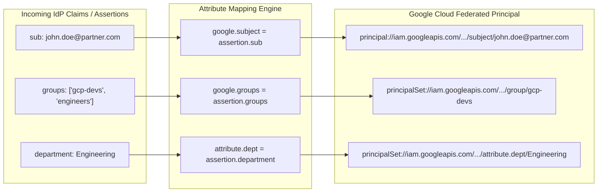

# Attribute Mapping

## Learning objectives

By the end of this lesson, you will be able to:

- Translate external Identity Provider (IdP) claims into the Google Cloud Common Expression Language (CEL) syntax.
- Differentiate between Google's built-in attributes (`google*`) and custom attributes (`attribute*`).

## The Concept: The Universal Translator

In the previous module, you got Alice (PartnerCorp) logged in. But right now, to Google, Alice looks like a meaningless string of characters.

- **Okta says**: `User: 00uxopt8eu42Ade2q697 | Job: Dev | Level: L4`
- **Google IAM says**: "I don't know what 'Job' or 'Level' means. I only speak 'Google'."

**Attribute Mapping** is the configuration where you teach Google how to read the Partner's ID badge. You are writing a dictionary that says:

- When they say 'Job', interpret that as 'Department'.

## The Syntax: `Left = Right`

The grammar of mapping is strict but simple. It uses **Common Expression Language (CEL)**.

```bash
TARGET_ATTRIBUTE = SOURCE_ASSERTION
```

- **The Left Side (Target)**: What Google calls the data.
- **The Right Side (Source)**: What the IdP sends (accessed via the keyword **assertion**).

### 1. The Built-in Attributes

Google has three reserved "buckets" that you must or can fill.

| Google Attribute | Description | Required? | Typical Mapping |
| :--- | :--- | :--- | :--- |
| **google.subject** | **The Who**. The unique ID of the user. | **YES** | **assertion.sub** or **assertion.oid** |
| **google.display_name** | **The Label**. What shows up in the top-right of the console. | No | **assertion.name** or **assertion.displayname** |
| **google.groups** | **The List**. A list of group memberships. | No | **assertion.groups** |

### 2. The Custom Attributes

This is where the magic happens. You can create your own buckets to hold data specific to your business logic, like "Cost Center," "Project ID," or "Clearance Level."

| Custom Attribute | Description | Required? | Typical Mapping |
| :--- | :--- | :--- | :--- |
| **attribute.department** | Department the user works in. | **No. Custom defined** | **assertion.custom_job_role** |

## The Process: Configuring the Map

Let's map Alice's identity for the **GlobalTech** scenario.

### The data from Okta (the source)

```bash
{
  "sub": "alice-123",
  "email": "alice@partnercorp.com",
  "custom_job_role": "engineering",
  "location": "us-east"
}
```

1. **Map the Subject:**
    - Logic : You want to identify her by her email, not her cryptic ID.
    - Code : **google.subject = assertion.sub** or **assertion.oid**
2. **Map the Name:**
    - Logic : Make the UI look nice.
    - Code : **google.display_name = assertion.email**
3. **Map the Department (Custom):**
    - Logic: You need to know she is in Engineering to give her server access later.
    - Code: **attribute.department = assertion.custom_job_role**

**Crucial Step**: Before you can map **attribute.department**, you must define it in the Pool settings. You cannot map to a bucket that doesn't exist.

## Visualizing the transformation

Study this diagram to observe how the data changes form.

| Okta User (Incoming) | The Mapping Filter | Google Principal (Outgoing) |
| :--- | :--- | :--- |
| `sub: "alice-123"` | Ignore | (Dropped) |
| `email: "alice@partner.com"` | google.subject = assertion.email | **Principal ID**: `alice@partner.com` |
| `custom_job_role: "eng"` | attribute.dept = assertion.custom_job_role | **Attribute**: `dept: eng` |
| `location: "us-east"` | Ignore | (Dropped) |

**Result**: Google now recognizes a user named "`alice@partner.com`" who has a tag of "`dept: eng`".

## Advanced logic: CEL function

Sometimes the data from the IdP is messy. You can use [CEL functions](https://docs.cloud.google.com/eventarc/advanced/docs/receive-events/use-cel#string-manipulation-operators) to clean it up during the mapping.

### Scenario

Okta sends `email: "alice@partnercorp.com"`.

You only want the username (**Alice**) to be the display name.

### The Fix

```bash
google.display_name = assertion.email.split('@')[0].title()
```

- This splits the string at the **@** symbol and takes the first part (index 0).
- **Result**: **google.display_name** becomes **Alice**.

## Summary

You have successfully translated Alice's "Job Role" into a Google "Attribute."

But what if you want to block Alice entirely if she isn't in the "Engineering" department? You don't just want to label her; you want to gatekeep her.

In the next lesson, you will use Attribute Conditions to create security guardrails that allow or reject users at the door based on their data.

## Architecture & Workflow Diagram


