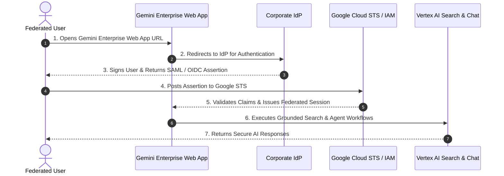

# Grant federated users access to Gemini Enterprise

## Learning objectives

By the end of this lesson, you will be able to:

- Provide third-party users access to Gemini Enterprise
- Configure your AI Applications identity provider to use a workforce pool
- Configure integrations with your Gemini Enterprise app

## Enabling Federated Workforce Access to Gemini Enterprise

This demonstrates how to configure Gemini Enterprise access for federated users and verify end-user login.

### Step-by-Step Walkthrough

1. Access Gemini Enterprise Console: In the Google Cloud Console, open **Gemini Enterprise** (Vertex AI Search & Conversation).
2. Open Application Settings: Navigate to your deployed Gemini Enterprise app and select the **Settings** tab.
3. Based on the location of the App and users, select one of the Locations(Global, us, eu), and configure it to use third party identity provider by clicking on edit button. Paste the Workforce pool URL here (`locations/global/workforcePools/POOL_ID`) and click on save.
4. Open Application Integrations: Navigate to your deployed Gemini Enterprise app and select the **Integrations** tab.
5. Navigate to "Choose an identity provider" > "Use a third-party identity provider". Workforce Pool ID Should already be configured as per the above. Fill the "Workforce provider ID" and enter the providers OIDC string.
6. End-to-End Test: Open the Web App URL in an incognito window, log in via your external IdP, and start searching and prompting Gemini Enterprise.

## Summary

You have now granted third-party federated users access to Gemini Enterprise, by configuring an integration between AI Applications and your Gemini Enterprise app using your workforce pool.

## Architecture & Workflow Diagram

