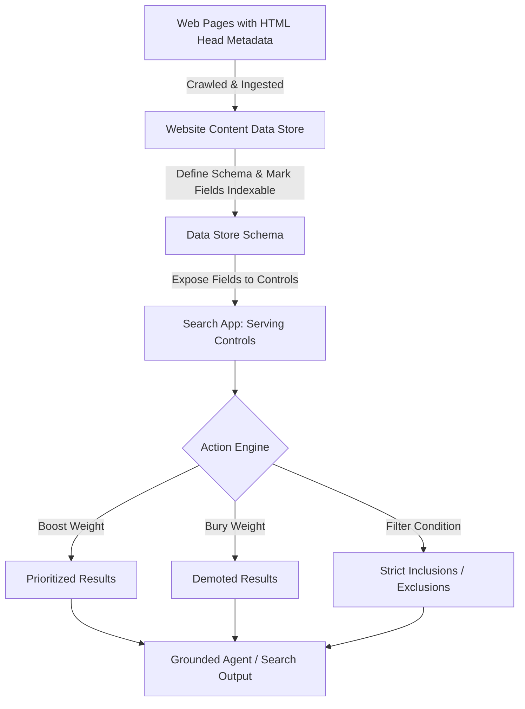
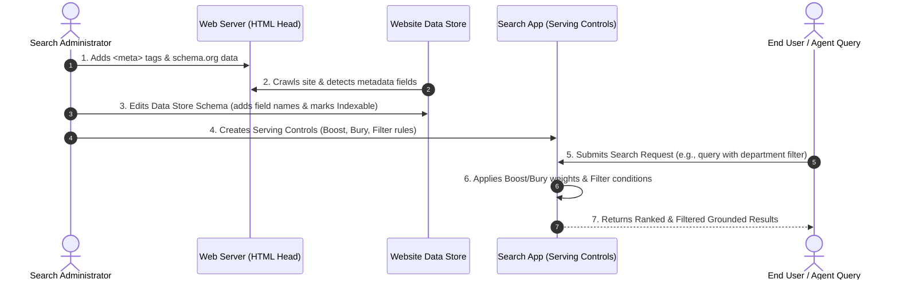

# Add meta tags to filter and boost web content

**Video Resource:** [Add meta tags to filter and boost web content](https://youtu.be/XuzrkQdiW1o) (Duration: 2m 17s)  
**Platform:** Google Cloud Agent Platform / Vertex AI Search / Gemini Enterprise

---

## Learning Objectives

By the end of this lesson, you will be able to:

- Implement HTML `<meta>` tags and structured data schemas (`schema.org` JSON-LD) to enrich web content for enterprise search.
- Differentiate between manual metadata attributes and automatically inferred **byline dates** (`datePublished`, `dateModified`).
- Configure website content **Data Store schemas** by adding custom tag names and setting them as **indexable**.
- Define **Serving Controls** (Boost, Bury, Filter) within the Agent Platform Search App to dynamically tune search ranking and query filtering.

---

## Overview: Metadata-Driven Search Optimization

In enterprise search deployments, search relevancy is not solely dictated by text embeddings or keyword density. **Meta tags** allow web content authors and administrators to provide deterministic signals that instruct the crawler and search engine how to prioritize, segment, and filter documents.

Gemini Enterprise and Agent Search support serving controls that operate directly on these metadata fields:

- **Boost:** Elevates specific documents higher in search rankings when matching criteria are met (e.g., higher relevance for specific departments or curated landing pages).
- **Bury:** Demotes documents down the search ranking list (e.g., archival documentation or pages containing edge-case data).
- **Filter:** Statically or dynamically restricts search results to only those matching exact criteria (e.g., only content published in the last 12 months, or documents restricted to the Human Resources department).



---

## Providing Metadata on Web Pages

Metadata must be placed within the `<head>` section of the HTML document. There are three primary mechanisms supported:

### 1. Standard HTML `<meta>` Tags & Open Graph Properties

Custom name-value pairs identify page attributes, categories, and permissions. Open Graph properties (such as `og:image`) can also guide thumbnail rendering on mobile devices and conversational interfaces.

```html
<!DOCTYPE html>
<html lang="en">
<head>
    <meta charset="UTF-8">
    <title>Employee Benefits Overview 2026</title>
    
    <!-- Custom Organization Metadata -->
    <meta name="department" content="human_resources,finance">
    <meta name="content_type" content="policy_doc">
    <meta name="access_level" content="internal">
    <meta name="valid_until" content="2026-07-01">
    
    <!-- Open Graph for Rich Display Previews -->
    <meta property="og:title" content="Employee Benefits Guide">
    <meta property="og:image" content="https://corp.example.com/images/benefits-thumb.png">
</head>
<body>
    <!-- Content Body -->
</body>
</html>
```

### 2. Structured Data via `schema.org` (JSON-LD)

You can embed `schema.org` JSON-LD scripts inside the `<head>` block. This format is ideal for hierarchical or structured entity definitions.

```html
<head>
    <script type="application/ld+json">
    {
      "@context": "https://schema.org",
      "@type": "Article",
      "headline": "Fiscal Year 2026 Travel and Expense Policy",
      "author": {
        "@type": "Organization",
        "name": "Corporate Finance"
      },
      "datePublished": "2025-07-01T08:00:00+00:00",
      "dateModified": "2026-01-15T10:30:00+00:00"
    }
    </script>
</head>
```

### 3. Page Maps

Page maps allow XML-style metadata blocks to be embedded directly into HTML comments for Google crawlers:

```html
<!--
<PageMap>
  <DataObject type="document">
    <Attribute name="department">finance</Attribute>
    <Attribute name="doc_status">active</Attribute>
  </DataObject>
</PageMap>
-->
```

---

## Inferred Properties: Byline Dates

Google crawlers automatically infer and index **Byline Dates** when indexing web content without requiring manual additions to the data store schema:

* **Date Published (`datePublished`):** The date and time when the page was first created and published.
* **Date Modified (`dateModified`):** The date and time when the content was most recently updated.

> [!TIP]
> You can directly leverage `datePublished` and `dateModified` in serving controls (e.g., boosting documents updated within the last 90 days or filtering out documents older than 365 days) without editing your data store schema.

---

## End-to-End Configuration Workflow



### Step 1: Configure Website Data Store Schema

1. In the **Google Cloud Console**, navigate to **Agent Builder / Vertex AI Search & Conversation** > **Data Stores**.
2. Select your **Website Content Data Store**.
3. Under the **Schema** tab:
   * Add each custom meta tag key (e.g., `department`, `content_type`, `valid_until`).
   * Select the appropriate data type (e.g., `String`, `DateTime`).
   * Toggle the field attribute to **Indexable**.

> [!IMPORTANT]
> A field **must be marked as Indexable** in the schema before it can be referenced in serving controls or used as a query-time filter.

### Step 2: Configure Serving Controls in the Search App

1. In the console, navigate to **Apps** > select your **Search / Agent App**.
2. Go to the **Controls** tab (Serving Controls) and click **Create Control**:
   * **Boost/Bury Control:**
     * Specify conditions (e.g., `department EQUALS "finance"`).
     * Set a boost factor between `-1.0` (strongest bury) and `+1.0` (strongest boost).
   * **Filter Control:**
     * Define strict inclusion/exclusion rules (e.g., `dateModified >= "2025-01-01"`).

### Step 3: Query-Time Dynamic Filtering

Applications can also pass filter strings directly in the API / SDK query payload:

```json
{
  "query": "remote work policy",
  "filter": "department: ANY(\"human_resources\", \"legal\") AND dateModified >= 2025-01-01T00:00:00Z"
}
```

---

## Common Enterprise Use Cases

| Scenario | Control Type | Configuration Logic | Expected Outcome |
| :--- | :--- | :--- | :--- |
| **Departmental Relevance** | Boost | `department EQUALS user_department` | Finance staff see finance-oriented travel rules before generic company announcements. |
| **Outdated Content Prevention** | Filter | `valid_until >= CURRENT_DATE` | Prevents expired policies or obsolete compliance documents from surfacing in agent answers. |
| **Landing Page Highlighting** | Boost | `content_type EQUALS "landing_page"` | Directs users to primary portals rather than auxiliary deep sub-pages. |
| **Freshness Priority** | Boost | `dateModified >= NOW - 180 DAYS` | Ensures newer documentation takes precedence over legacy architectures. |
| **Deprecation Archival** | Bury | `status EQUALS "deprecated"` | Pushes legacy manuals to the bottom of the results without removing them from index. |

---

## Verbatim Video Transcript

<details>
<summary>Click to view the full audio transcript from the recorded lesson</summary>

> "Another way to improve search results is by adding meta tags to filter and boost web content. You do this by defining fields for use in serving controls.
>
> Within an HTML document's head section, you can add meta tags to provide metadata about a page. That information can then be used by bots and systems displaying web content. For example, a meta tag with an open graph image property can instruct a mobile device to render a thumbnail preview for a page.
>
> Agent Search and Gemini Enterprise can use meta tags to boost, bury, or filter results. For example, these tags could be used to boost this page in search results for employees in the finance and human resources departments because the department value identifies this content as belonging to that department. Or filter results to only include content published in the past year, so this page would be visible until the 1st of July 2026 unless updated before then.
>
> There are many other use cases that you can apply this feature to. For example, you can choose to boost newer results, allow users to filter by certain types of content such as docs, boost landing pages you would like to highlight, or bury pages that are older than a certain date, or aren't intended as general information.
>
> You can also provide metadata through page maps or using schema.org JSON within a script tag in the HTML head section. These fields, called byline dates, are automatically inferred and indexed by Google when indexing your site. Date published, which is the date and time when the page was first published. And date modified, which is the date and time when the page was most recently modified. You can directly use these date properties to enrich your search without adding them to your schema. To add byline dates to your website, go to influence your byline dates in Google Search.
>
> To use the metadata, edit the website content data store schema to add your tags' names. Mark your fields as indexable to use them in serving controls. You can then use this meta category as a filter in queries. Here's an example query that is using filtering with the department tag. And you can also configure serving controls in your search apps control tab."

</details>
