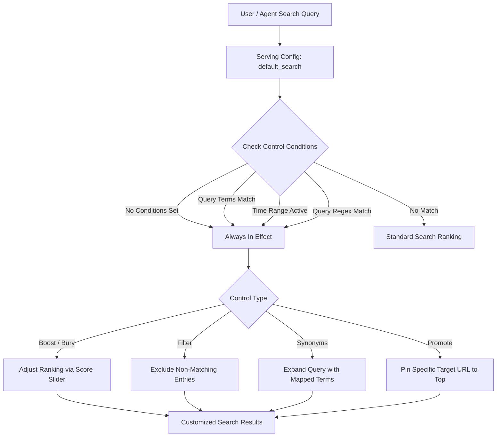
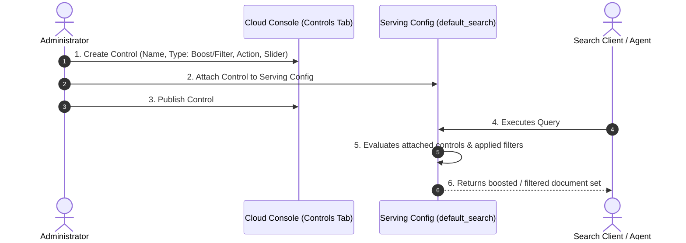

# Boost and filter search results with serving controls

**Video Resource:** [Boost and filter search results with serving controls](https://youtu.be/88AfdiRT47s) (Duration: 2m 54s)  
**Platform:** Google Cloud Agent Platform / Vertex AI Search / Gemini Enterprise

## Learning Objectives

By the end of this lesson, you will be able to:

- Explain how **Serving Controls** alter the default behavior of search requests.
- Understand the critical requirement of attaching controls to **Serving Configs**.
- Compare the four primary serving control types: **Boost/Bury**, **Filter**, **Synonyms**, and **Promote**.
- Configure trigger conditions: **Query Terms**, **Time Range**, and **Query Regex**.
- Create and publish serving controls in the Google Cloud Agent Platform console.

## Overview: Serving Controls Architecture

In Google Cloud Agent Platform (and Vertex AI Search), **Serving Controls** allow administrators to intercept and modify how search requests are processed and how results are ranked or filtered before being returned to the user or conversational agent.

> [!IMPORTANT]
> **The Serving Config Rule:**  
> A control only affects search requests for the **Serving Configs** to which it is actively attached (such as `default_search`). If a control is created but not attached to a serving config, it has **no effect**.

## Types of Serving Controls

| Control Type | Core Function | Typical Use Case |
| :--- | :--- | :--- |
| **Boost or Bury** | Changes the ranking order of returned results by increasing or decreasing ranking scores based on a slider value (`-1.0` to `+1.0`). | Promoting high-severity advisories, prioritizing newer documentation, or demoting outdated manuals. |
| **Filter** | Strictly excludes entries from the result set if they do not satisfy the specified filter conditions. | Restricting queries to active documents, specific departments, or critical-only security alerts. |
| **Synonyms** | Associates query strings with one another bidirectionally or unidirectionally. | Ensuring queries for *"PTO"*, *"leave"*, and *"vacation"* return equivalent results. |
| **Promote** | Pins a specific destination URL to the very top of the results for designated query triggers. | Directing users searching for *"benefits"* straight to the open enrollment portal page. |

## Trigger Conditions

By default, if **no trigger conditions** are defined, the serving control is **always in effect** for any search request sent to its attached serving config.

When conditions are desired, one or more of the following can be configured:

### 1. Query Terms

The control triggers only when the search query contains specific predefined keywords or phrases (e.g., triggering a promotion only when users search for *"open enrollment"* or *"expense claim"*).

### 2. Time Range

The control remains active only during a specific calendar window with explicit start and end timestamps. This is ideal for seasonal campaigns, planned outages, or compliance auditing periods.

### 3. Query Regex

The control activates when the user query matches a regular expression pattern (e.g., matching policy IDs like `POL-[0-9]{4}` or region codes).

## Actions & Target Specifications

Once a condition matches (or if always active), the control applies its defined action:

- **Target Data Store:** Specifies which data store within a multi-data-store search application is subject to the control.
- **Filter Requirements:** Defines logical attribute conditions that documents must satisfy (e.g., `department EQUALS "advisories"` and `severity EQUALS "critical"`).
- **Boost / Bury Slider Bar:** Sets the intensity of ranking adjustment. Positive values promote items; negative values demote items.

## Step-by-Step Walkthrough: Creating a Serving Control

### Step 1: Open the Controls Tab

1. In the **Google Cloud Console**, navigate to **Agent Builder / Vertex AI Search & Conversation**.
2. Select your **Search App**.
3. In the left navigation, click the **Controls** tab.

### Step 2: Define Control Details & Type

1. Click **Create Control**.
2. Provide a descriptive **Control Name** (which auto-generates the Control ID).
3. Select the **Control Type**:
   - *Boost/Bury*
   - *Filter*
   - *Synonyms*
   - *Promote*

### Step 3: Configure Conditions (Optional)

- Choose whether to leave conditions blank (**Always in effect**) or add:
  - **Query terms**
  - **Time range** (start date/time to end date/time)
  - **Query regex**

### Step 4: Configure Actions & Requirements

1. Select the **Target Data Store** (e.g., `advisories-data-store`).
2. Set the **Filter Requirements** (e.g., `severity EQUALS "critical"`).
3. For Boost/Bury controls, adjust the **Slider Bar** to set the desired promotion or demotion weight.

### Step 5: Publish and Attach

1. In **Additional settings**, choose **Publish control immediately**.
2. Verify attachment to the desired **Serving Config** (`default_search`).
3. Click **Submit**.

> [!TIP]
> **Observation:** Before applying a filter control, search results might display entries with unranked or undetermined ratings (e.g., `severity: unknown`). Once the filter control is applied and published, all non-matching entries are stripped out, returning exclusively items matching `severity: critical`.

## Verbatim Video Transcript

Next, let's find out how to boost and filter search results with serving controls.

You can use serving controls to change the default behavior of a search request. There are two types of controls. Boost controls, which can apply filters to the content to promote or demote the search results. And filter controls, which specify the requirements met by the document in order to be included in the response.

To change the results of a request, first create a control, and then attach it to a serving config. A control only affects search requests with serving configs that the control is attached to. If a control isn't attached to any serving config, it has no effect.

In the control tab, you can create and configure serving controls for your search app or widget. Serving controls are used to change the default behavior of how a request is served when results are returned. For example, controls can boost and bury results, filter entries from returned results, associate strings with each other as synonyms, or promote a particular URL for a query.

To create a control, you need to define the actions you want to trigger, starting with a control name, which will become the control ID, and choose a control type. The control types you can choose from are boost or bury control, which changes the returned order of results. Filter control, which removes entries from returned results. Synonyms control, which associates queries with each other. And promote control, which promotes a specified link for a query. In this example, posts with a severity rating of critical are going to be boosted.

Next, you need to set the conditions that trigger the serving control. If no conditions are configured, then the control is always in effect. The types of conditions you can configure are query terms, an optional control that's applied when specific queries are searched for. Time range, an optional control that's applied when a request occurs within a specified time range. And query regex, an optional condition that applies the control when the query matches the specified regular expression.

Next, you need to define the actions you want to trigger with the control. For example, a boost action, a filter action, a promote action, or synonyms action. You need to select a data store that can be boosted or buried by the control, and a filter that specifies the requirements that must be met. Additionally, there is a slider bar where you can select a value for how much to boost or bury the results with the control. In this example, any items from the advisories department data store with a critical severity rating will be boosted.

Finally, in the additional settings, you can complete the creation of your control by publishing your control immediately and clicking submit.

Before the filter was applied, you may notice that the returned search results are showing a rating of severity unknown. However, once the control has been applied, only search results with a critical severity rating are returned.
