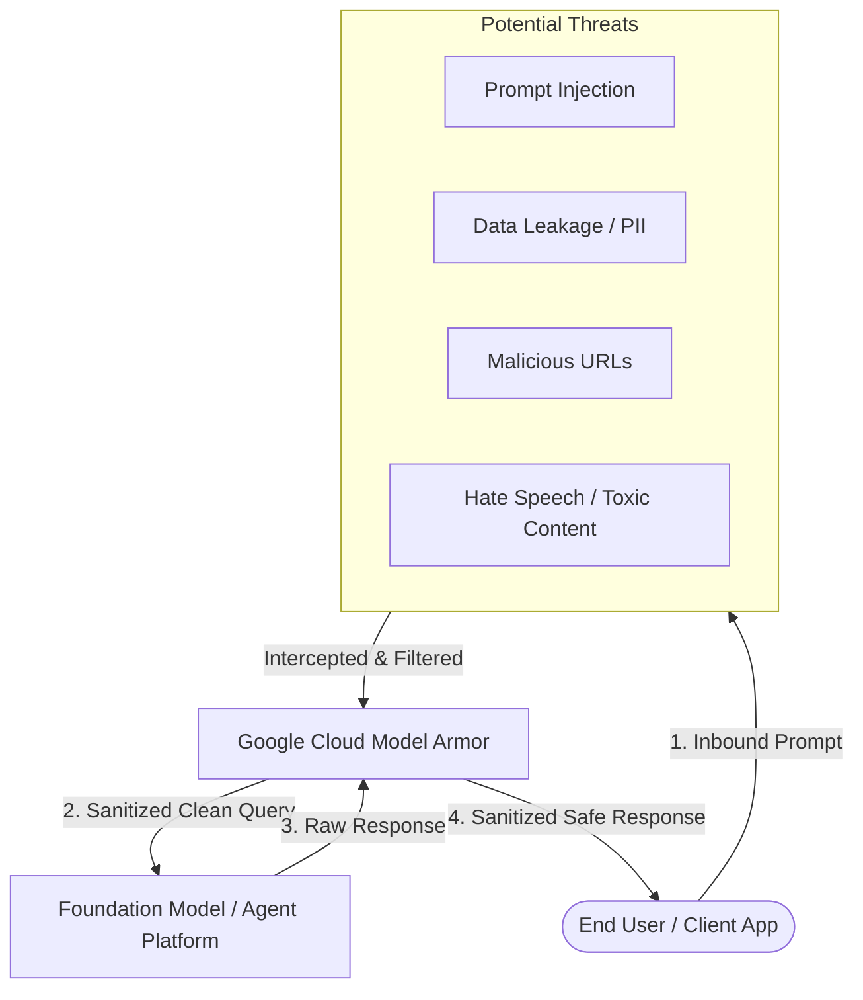

# What's in it for me?

**Video Resource:** [Welcome to Model Armor](https://youtu.be/fH62NUGwsyo)  
**Platform:** Google Cloud Model Armor / Gemini Enterprise Security Perimeter

---

## Learning Objectives

By the end of this lesson, you will be able to:

- Explain the primary security mission and purpose of Google Cloud Model Armor in an enterprise security portfolio.
- Identify the emerging threat landscape targeting Generative AI applications, large language models (LLMs), and intelligent agents.
- Understand how Model Armor acts as a protective shield for both inbound prompts and outbound model responses.
- Recognize the core mechanisms used to enforce AI security: organizational Floor Settings and granular Templates.

---

## The Enterprise Challenge: Protecting Valuable AI Assets

If you are deploying generative AI and intelligent enterprise agents, you have something critical to safeguard: your proprietary organizational data, internal agent communications, user interactions, and enterprise backend systems.

Organizations invest massive amounts of engineering time, financial capital, and strategic effort into developing custom agents and grounding them with enterprise data stores. However, like any high-value asset, these systems present an attractive target for adversaries:

- **Prompt Injections & Jailbreaks:** Attackers craft manipulative instructions to circumvent system rules and hijack agent behavior.
- **Sensitive Data Leakage:** Accidental or malicious exposure of personally identifiable information (PII), confidential IP, financial records, or credentials.
- **Malicious Content & URIs:** Insertion of dangerous links or phishing redirects into user prompts or generated model completions.
- **Data Poisoning & Misuse:** Compromising grounding corpora or influencing models to output unsafe, toxic, or brand-damaging responses.

---

## Video: Welcome to Model Armor

Watch this introductory overview exploring why modern enterprise deployments require Model Armor.

**Video Link:** [Welcome to Model Armor](https://youtu.be/fH62NUGwsyo) (YouTube: `fH62NUGwsyo`)

### Key Takeaways

- **No Need to Panic:** While novel generative AI threats are real and complex, Model Armor provides a unified, managed defense-in-depth security layer.
- **Turnkey Protection:** Defends applications against prompt injections, data leakage, toxic content, and unsafe URLs without requiring complex, custom security wrappers.
- **Enterprise-Wide Coverage:** Protects both customer-facing applications and internal workforce agents.

#### Full video transcript

So, you've just created an LLM. Good for you. I'm sure you're protecting it appropriately. Surely you're protecting it against prompt injection, data leakage, malicious URLs. Hey, hey, now, no need to panic. That's what Google Cloud Model Armor is for. Model Armor is designed to protect against several security threats in generative AI applications by screening LLM prompts and responses. Think of it like your LLM having airport security. Don't worry, your model won't feel a thing. When a prompt comes in, it has to put its bag on that conveyor belt. If the prompt is deemed harmful, security will raise an alert. Likewise, the LLM's response also goes through that security conveyor belt to make sure nothing funky is going on. So, now you have everything you need to start using model armor, right? Just kidding. We have all the content you need to get your LLM secured. Stay tuned.

---

## What You Will Learn in this Course

Throughout this course, you will develop the technical capabilities required to design, deploy, and govern Model Armor across your Google Cloud enterprise footprint:

1. **Model Armor Architecture:** Understand the inner mechanics of the Model Armor inspection engine, filter categories, and security boundaries.
2. **Floor Settings Configuration:** Establish non-negotiable minimum security standards across your Organization, Folders, and Projects.
3. **Template Design & Customization:** Build reusable, granular security policies combining Sensitive Data Protection (SDP), Responsible AI (RAI), and Prompt Injection detectors.
4. **Gemini Enterprise Agent Platform Integration:** Activate zero-code inline protections to secure intelligent agents effortlessly.
5. **API & Application Integration:** Integrate the Model Armor Python SDK into custom application runtimes to programmatically sanitize prompts and responses.
6. **SecOps Monitoring & Audit Logging:** Query Cloud Logging to investigate policy infractions, track detector matches, and maintain audit compliance.

> [!TIP]
> Model Armor operates on both **prompts** (what users and systems send into the model) and **responses** (what the model generates). Always design your security policies to screen both pathways.
