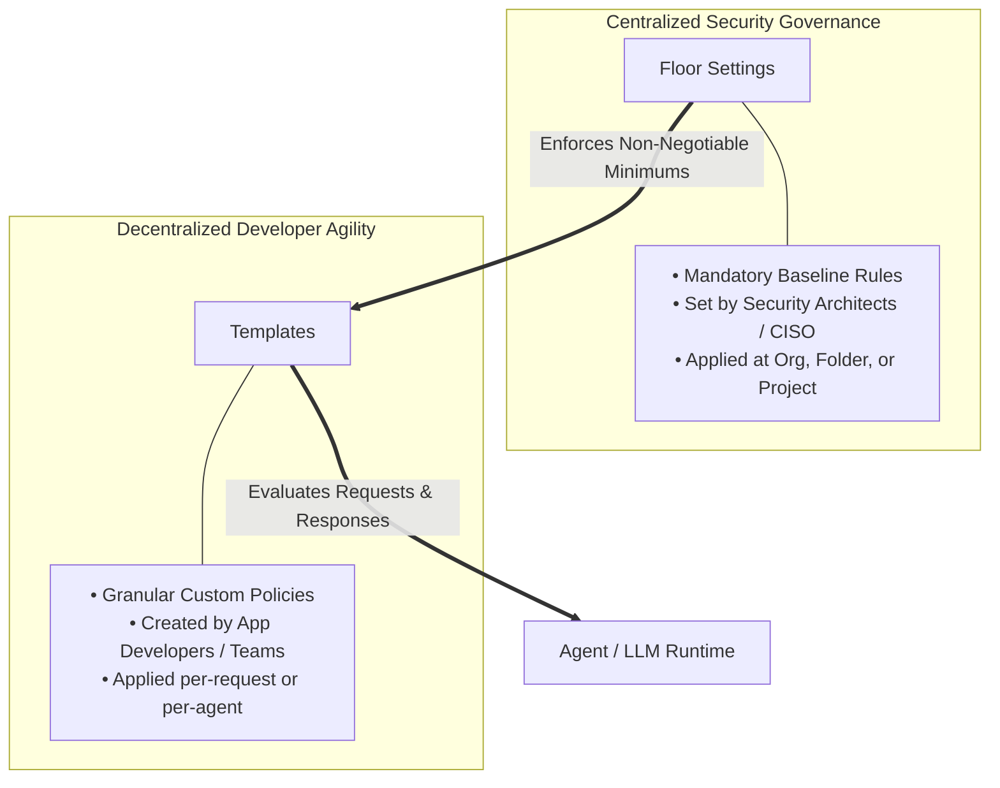

# About customization

**Platform:** Google Cloud Model Armor / Policy Customization & Governance

---

## Learning Objectives

By the end of this lesson, you will be able to:

- Explain why "one size fits all" security is inadequate for enterprise AI deployments.
- Contrast the distinct architectural responsibilities of **Floor Settings** versus **Templates**.
- Formulate a layered governance strategy that balances centralized organizational compliance with decentralized developer agility.

---

## The Philosophy of AI Security Customization

One size fits all? That is a fantasy for both clothing and enterprise security. Your organization is not a monolith:

- Your internal **HR support bot** requires strict privacy filtering to prevent employee PII and health information from leaking.
- Your **software development agent** requires permissive code generation and technical jargon analysis without triggering false-positive safety flags.
- Your **public customer-facing chatbot** requires aggressive guardrails against prompt injection, offensive language, and brand spoofing.

To deliver this level of tailored protection, Google Cloud Model Armor is engineered around two complementary pillars:

---

## Floor Settings vs. Templates: Strategic Comparison

| Architectural Attribute | Floor Settings (Guardrail Foundation) | Templates (Custom Application Shields) |
| :--- | :--- | :--- |
| **Primary Owner** | Chief Information Security Officer (CISO) / Cloud Security Architect | Application Development Teams / AI Engineers |
| **Scope of Enforcement** | Organization, Folder, or Project level | Specific applications, endpoints, or individual calls |
| **Enforcement Nature** | Non-negotiable minimum baseline. Cannot be weakened by child configurations. | Flexible and context-specific. Can be tightened further as needed. |
| **Configuration Focus** | Mandatory minimum confidence thresholds, required filter types. | Specific de-identification methods, domain lists, custom keyword dictionaries. |
| **Lifecycle Timing** | Established first during environment landing zone provisioning. | Iteratively created and refined as new AI workloads are deployed. |

---

## Architectural Interaction: How They Work Together

When an application developer creates a template or sends a prompt to Model Armor, the engine does not evaluate the template in isolation. It validates the configuration against the active **Floor Settings** hierarchy:

1. **Baseline Verification:** If an ancestor floor setting mandates that *Prompt Injection and Jailbreak (PIJB)* must be set to `MEDIUM_AND_ABOVE`, a developer cannot create a template with PIJB set to `HIGH_AND_ABOVE` (which would catch fewer attacks) or disable it entirely.
2. **Layered Tightening:** A developer can always make a template *stricter* than the floor setting (for example, setting sensitive data detection to `LOW_AND_ABOVE` to catch even low-confidence matches), but never looser.

> [!NOTE]
> Think of floor settings as building codes: the city inspector mandates the structural foundation, while the architect chooses the interior decor. Both are essential to a secure building.
