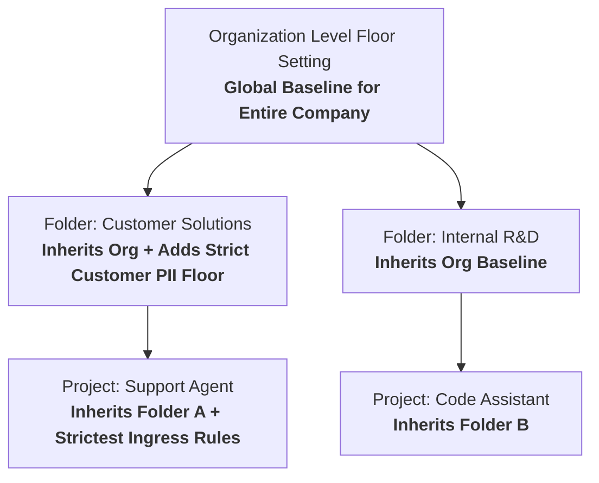

# Floor settings

**Video Resource:** [Configuring Model Armor Floor Settings](https://youtu.be/y7A3eZ2d9AE)  
**Platform:** Google Cloud Resource Manager / Model Armor Governance

---

## Learning Objectives

By the end of this lesson, you will be able to:

- Articulate the "Golden Rule" of Model Armor floor settings configuration.
- Identify the three resource hierarchy levels where floor settings can be established: Organization, Folder, and Project.
- Explain the inheritance model and precedence hierarchy across the resource tree.
- Analyze the operational impact when existing floor settings are modified in an active production environment.

---

## The Golden Rule of Floor Settings

> [!IMPORTANT]
> **The Golden Rule:** Always create your **Floor Settings** before developers begin building and deploying **Templates**.

Think of it like constructing a building: you never build the walls or furnish the rooms before pouring the concrete foundation. If developers build templates without established floor settings, those templates may establish inconsistent or insecure baseline configurations that will later break validation when enterprise floor settings are retroactively applied.

---

## The Three Resource Hierarchy Levels

Model Armor leverages the Google Cloud Resource Manager hierarchy to enforce security policies at scale:

### 1. Organization Level

- **Scope:** Applies globally to all folders, projects, and resources within the Google Cloud organization.
- **Ideal Use Case:** Mandating enterprise-wide non-negotiables, such as enforcing core Responsible AI (CSAM, self-harm, hate speech) and baseline prompt injection defenses across all AI workloads.

### 2. Folder Level

- **Scope:** Applies to all projects nested under a specific departmental or environment folder (e.g., `Production`, `Staging`, `Finance`, `Healthcare-B2C`).
- **Ideal Use Case:** Establishing domain-specific regulatory baselines (e.g., mandating HIPAA-aligned Sensitive Data Protection across all projects in the Healthcare folder).

### 3. Project Level

- **Scope:** Enforces rules directly on a specific Google Cloud project.
- **Ideal Use Case:** Applying inline enforcement for Gemini Enterprise Agent Platform or defining project-specific constraints without affecting sister projects.

---

## Video: Configuring Model Armor Floor Settings

Watch this in-depth guide to understanding floor settings architecture and resource inheritance.

**Video Link:** [Configuring Floor Settings](https://youtu.be/y7A3eZ2d9AE) (YouTube: `y7A3eZ2d9AE`)

### Key Takeaways

- **Inheritance & Accumulation:** Floor settings inherit downward. A project inherits the constraints of its parent folder and grandparent organization.
- **Strict Monotonicity:** A child floor setting or template can only *increase* strictness, never decrease it.
- **Validation Engine:** The floor setting acts as a real-time validator whenever templates are created or updated.

> SPEAKER 1: Let's talk
about floor settings. SPEAKER 2: All right. So what do we got,
hardwood, carpet, tile? [RECORD SCRATCH] OK, sorry. Floor settings. SPEAKER 1: Floor settings
are project, folder, or organization-wide minimum
configurations for Model Armor. If someone tries to create a
template with less strict safety filters, these floor
settings will overrule them and cause an error, ensuring
that the baseline is always met. SPEAKER 2: OK, so
it's like a you must be this tall to
ride the ride sign, but for an entire
amusement park. SPEAKER 1: Right. But no amount of
napkins in your shoes is going to fake out that sign. SPEAKER 2: Did you ever do
that at amusement parks? SPEAKER 1: Yeah,
it never worked. SPEAKER 2: Of course, it didn't. It's going to give you like
a millimeter of extra height. SPEAKER 1: Yeah, yeah,
yeah, yeah, yeah. Anyway, we're
talking about filters for responsible AI, prompt
injection and jailbreak, malicious URI, and
sensitive data protection, and how to set minimum
confidence thresholds for when these filters should trigger. SPEAKER 2: All right,
let's get practical. How do we actually set
these floor settings? SPEAKER 1: Well, like most
things in Google Cloud, there are many ways
to do the same thing. So I'm just going to cover
the way I prefer to do it. SPEAKER 2: I would
expect nothing less. SPEAKER 1: Start by heading to
Model Armor in the Google Cloud Console. And here, we have an area
called Floor Settings. SPEAKER 2: OK. So far, it's straightforward. SPEAKER 1: Makes sense, right? From here, we can create
new floor settings for all the areas we want to
protect our models against. SPEAKER 2: Got it. So I'm seeing here we've got
Prompt Injection and Jailbreak, Sensitive Data Protection,
Responsible AI. SPEAKER 1: Exactly. And you can set confidence
levels for some of them. SPEAKER 2: Confidence
level meaning how confident Model
Armor is in identifying a violation in that area? SPEAKER 1: Exactly. So if you wanted
to raise an alert, even when it's not that
confident in the violation, then make the setting
low and above. This is the most
sensitive setting. SPEAKER 2: And if you want
it to be more laid back, then you'd set it to high? SPEAKER 1: You got it. This way, it only
raises an alert if it's extremely confident
that the violation has occurred. SPEAKER 2: Makes sense. So you checked off
Malicious URL Detection. What does that mean? SPEAKER 1: That means that any
new template that's created has to check for malicious URLs. If a template is made
that doesn't also have that checked
off, it will error out and fail to be created. SPEAKER 2: Got it. So what are templates all about? SPEAKER 1: I love
the enthusiasm, but you're getting a bit ahead. Templates set the
specific guidelines that Model Armor will follow. The floor settings are
the overall guidance that the templates
have to adhere to. SPEAKER 2: OK, so Model
Armor will follow what the templates have in place. And the templates have
to follow the floor settings that have been set. SPEAKER 1: Nailed it. We'll get into templates
in detail next. Don't worry. [MUSIC PLAYING]

---

## Critical Considerations: Modifying Active Floor Settings

Enterprise environments evolve. If security leadership decides to increase a floor setting baseline, keep these operational rules in mind:

1. **Validation Enforcement Timing:** Floor setting validation is actively triggered whenever a template is **created** or **modified**.
2. **No Retroactive Invalidation of Running Traffic:** Modifying a floor setting does not immediately cause running inference calls with existing templates to throw configuration exceptions.
3. **Modification Lockout:** If an existing template is less strict than a newly updated floor setting, developers **cannot modify or update that template** until its configuration is brought into compliance with the new floor setting.

---

## Knowledge Check: Floor Settings Principles

Test your understanding of floor settings governance:

| Question / Card Front | Answer / Card Back | Key Takeaway |
| :--- | :--- | :--- |
| *True or False:* Floor settings should be configured as the final step after all application templates are finished. | **False** | Floor settings must be established **first** to ensure templates conform to the baseline from day one. |
| *Hierarchy Question:* Where can floor settings be declared in Google Cloud? | **Org, Folder, and Project levels** | Provides flexible scope for enterprise-wide, department-wide, or project-specific controls. |
| *Operational Scenario:* An existing template has PIJB set to Low. A new Org floor setting requires Medium. What happens? | **Template remains active, but cannot be modified until upgraded to Medium or High.** | Prevents configuration changes that violate the new organizational policy. |
