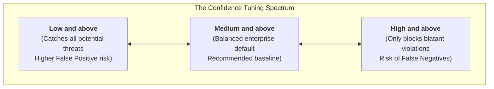
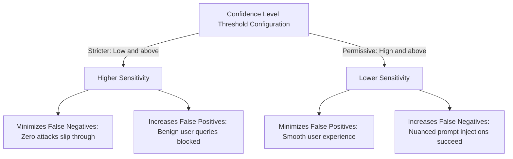

# Guard rails and confidence levels

**Platform:** Google Cloud Model Armor / Safety Classifier Tuning

---

## Learning Objectives

By the end of this lesson, you will be able to:

- Explain how Model Armor applies confidence scoring to offensive content, jailbreaks, and sensitive data.
- Balance the operational trade-off between **False Positives** (blocking benign business queries) and **False Negatives** (allowing malicious attacks).
- Configure the three confidence threshold tiers: **Low and above**, **Medium and above**, and **High and above**.
- Determine the appropriate confidence threshold for diverse enterprise workload archetypes.

---

## Teaching Model Armor to "Trust Its Gut"

Safety classifiers in Model Armor do not make binary black-or-white determinations; they calculate a statistical **confidence score** representing the probability that an evaluated piece of text matches a prohibited threat category.

When configuring Floor Settings and Templates, security architects choose a **Confidence Level Threshold**. This setting defines how certain Model Armor must be before it flags or blocks a request:

---

## Confidence Level Comparison Matrix

| Confidence Level Setting | Detection Philosophy | Security Stance | Operational Impact | Recommended Enterprise Workload |
| :--- | :--- | :--- | :--- | :--- |
| **Low and above** | *"If it looks even remotely suspicious, block it immediately."* | Maximum Paranoia / Zero Trust | High probability of flagging benign edge-case business queries (high false positives). | Regulated banking apps, high-security internal executive tools, ungrounded external consumer bots. |
| **Medium and above** | *"Block content when there is clear, substantiated evidence of violation."* | Balanced Security & Usability | Filters out genuine attacks while allowing normal, context-rich business language. | **Standard Enterprise Default** for internal workforce agents, customer support, and knowledge search. |
| **High and above** | *"Only intervene when the text is an unmistakable, blatant attack."* | Minimal User Disruption | Low false positive rate, but risks allowing subtle, nuanced adversarial attacks (false negatives). | Creative writing applications, developer coding assistants, technical research environments. |

---

## Balancing the False Positive vs False Negative Dilemma

Every security threshold configuration represents a calculated engineering trade-off:

### Guidance for Enterprise Security Teams

1. **Start with Medium and Above:** For most enterprise deployments, `Medium and above` provides robust protection without disrupting standard corporate communication.
2. **Monitor Logs Before Raising Sensitivity:** Use Cloud Logging to observe the frequency of detector matches in staging before moving production environments to `Low and above`.
3. **Use Granular Templates for Exceptions:** If a specific department (e.g., Legal or Security Research) needs to discuss topics that trigger safety filters, create a dedicated template with adjusted confidence levels rather than weakening the organizational floor setting.

> [!TIP]
> When integrating Model Armor with Gemini Enterprise, confidence levels apply individually across each safety category: Harassment, Hate Speech, Sexually Explicit Content, and Dangerous Content. You can set different thresholds for each category within the same template!
