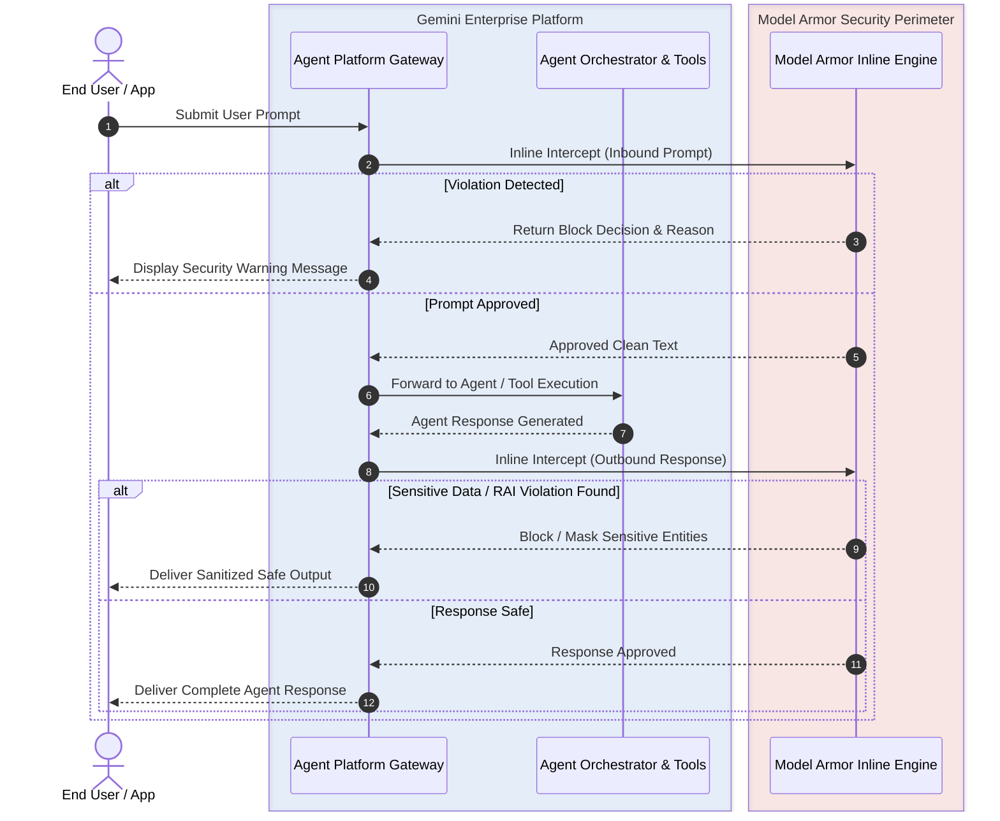
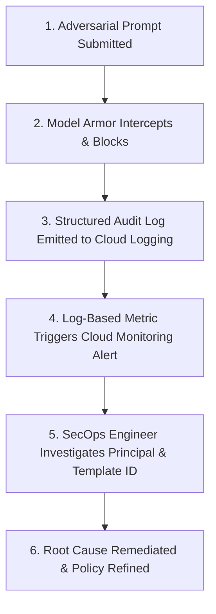

# Gemini Enterprise Agent Platform integration

**Platform:** Google Cloud Model Armor / Gemini Enterprise Agent Platform

---

## Learning Objectives

By the end of this lesson, you will be able to:

- Explain the architecture of **Inline Enforcement** between Model Armor and Gemini Enterprise Agent Platform.
- Evaluate the two integration models: Zero-Code Global Enforcement vs Granular Per-Request Security.
- Formulate architectural strategies for strict blocking behavior versus high-availability pass-through.
- Trace a complete incident response workflow from threat interception to SOC alerting in Cloud Logging.

---

## What is Inline Enforcement?

Up to this point, you have explored Model Armor as a validation engine and API endpoint. When integrated with **Gemini Enterprise Agent Platform**, Model Armor can act as an **Inline Interceptor**.

Instead of requiring application engineers to write custom API wrappers around every model call, project-level floor settings allow Model Armor to actively intercept traffic at the platform gateway:

---

## Two Integration Deployment Models

| Deployment Model | Implementation Mechanism | Developer Effort | Best Suited For |
| :--- | :--- | :--- | :--- |
| **1. Zero-Code Global Enforcement** | Configured at the **Project Floor Setting** level. Automatically intercepts all Agent Platform apps in the project. | **Zero Code** (Pure infrastructure & console configuration) | Enterprise IT environments where all agents must strictly conform to uniform security standards. |
| **2. Granular Application-Specific Security** | Developers specify a specific `template_id` directly in the Agent Platform request payload. | **Low Code** (Specifying template identifier in API call) | Multi-tenant applications, specialized departmental agents, or heterogeneous security tiers. |

---

## Pro Tips for Security Architects

### 1. Strict Block Behavior vs High-Availability Pass-Through

What happens if the Model Armor service or an external dependency experiences a transient network issue?

- **Strict Block (Fail-Closed):** If Model Armor is unreachable, the Agent Platform halts execution and blocks the request. Essential for high-security environments where unvetted prompts must never reach an LLM.
- **High-Availability Pass-Through (Fail-Open):** If Model Armor is unreachable, the request passes through uninspected to preserve user uptime. Appropriate for low-risk internal search tools.

### 2. Precedence Hierarchy

When both a Project Floor Setting and a Per-Request Template exist:

- The template enforces its customized rules, but the engine guarantees that no rule violates the Project Floor Setting baseline.

---

## Scenario: The "Developer Amnesia" Case Study

Consider a common enterprise scenario:

1. **The Scenario:** GlobalTech launches a pilot customer support agent powered by Gemini Enterprise Agent Platform.
2. **The Risk Vector:** An application developer writes an agent integration but forgets to implement client-side input validation or call Model Armor explicitly.
3. **The Solution:** The Security Architect previously enabled **Project-Level Floor Settings** with Inline Enforcement.
4. **The Result:** Even though the developer never wrote a single line of security code, an adversary attempting a prompt injection is blocked at the gateway, and a high-priority alert is emitted to the SecOps SIEM.

---

## SecOps Incident Lifecycle: From Interception to Resolution

> [!IMPORTANT]
> Zero-code inline protection is the ultimate safety net for enterprise AI architects. It ensures that security is baked into the platform infrastructure rather than relying on developer vigilance.
