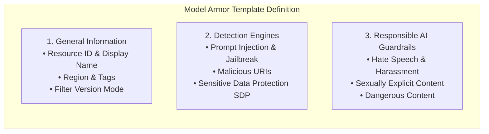
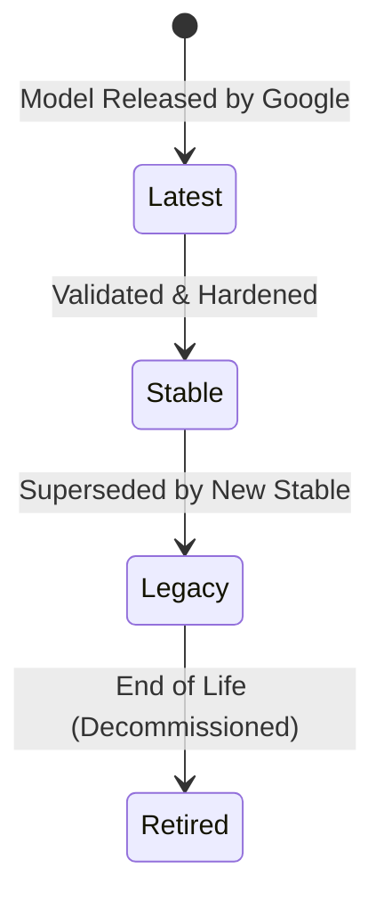
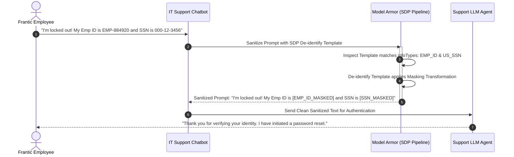

# Templates

**Video Resource:** [Building and Managing Model Armor Templates](https://youtu.be/5hf2ygzXKzc)  
**Platform:** Google Cloud Model Armor / Template Lifecycle Management

---

## Learning Objectives

By the end of this lesson, you will be able to:

- Deconstruct the three core components of a Model Armor Template: General Info, Detections, and Responsible AI.
- Manage the **Filter Version Lifecycle** across Latest, Stable, Legacy, and Retired stages.
- Configure advanced **Sensitive Data Protection (SDP)** using Inspect and De-identify templates.
- Implement an automated data masking workflow for enterprise support interactions.

---

## Anatomical Breakdown of a Template

A Model Armor Template represents a complete, self-contained security policy that can be attached to endpoints, agents, or client applications:

---

## Video: Building and Managing Model Armor Templates

Watch this walkthrough demonstrating how to create, configure, and operationalize templates.

**Video Link:** [Building Templates](https://youtu.be/5hf2ygzXKzc) (YouTube: `5hf2ygzXKzc`)

### Key Takeaways

- **Template Reusability:** Define complex security rules once and reference them across hundreds of microservices using a standard resource URI (`projects/.../locations/.../templates/...`).
- **Dynamic Configuration:** Supports per-request template overrides to tailor inspection to specific end-user roles or conversational contexts.
- **Multi-Region Availability:** Templates are deployed to specific Google Cloud regions to guarantee compliance with regional data sovereignty mandates.

#### Full video transcript

> SPEAKER: Imagine setting
your AI security rules once and having them perfectly
apply to every single one of your models every time. That's the beauty of
Model Armor templates. It makes managing security
across multiple AI deployments way easier and less error-prone. Today, I'm going to show
you exactly how easy it is to create one of
these templates right inside the Google Cloud Console. All right. So here we are in the
Google Cloud Console. We need to go to the
Security Command Center, and there are a bunch
of ways to get there. But I'm just going to go to
the menu, and then Security, and then Model Armor. And this is where you'll manage
your Model Armor configurations. And I'm going to click
on Create Template. First things first, let's give
our template a meaningful name. Let's call it Strict
Customer Data Policy and choose an
appropriate region. Under Detections, you'll
see different options to enable, malicious URL
detection, prompt injection and jailbreak
detection, and finally, sensitive data protection. Remember, these settings have to
align to the floor settings that have been set. So I'm going to enable
malicious URL detection and prompt injection
and jailbreak detection with a medium and
above confidence level, and then sensitive data protection. Now, sensitive data protection,
sometimes referred to as Data Loss
Prevention, or DLP, is where you tell Model Armor
how to find and handle sensitive information. Here there are two options,
basic and advanced. Basic allows you to screen
for a fixed set of data types, whereas advanced allows
you to work with a much larger set of data types. Also, with basic, you
don't have the ability to de-identify the data. Model Armor will just
flag the response. With advanced, however,
you're able to choose how the response will modify or
de-identify the sensitive data without blocking it entirely. When using the advanced
setting, you typically work with two concepts,
inspect and de-identify. Your inspect template
configuration is where you tell Model Armor
what kind of sensitive data to look for. Google Cloud provides
many built-in detectors for common types, like credit
card numbers, email addresses, passport numbers, and so on. You can usually select which
ones you want to include, and you can even create
custom detectors for needs specific to your business. So we're telling
Model Armor, hey, if you see anything that
looks like these types of sensitive data in a
prompt or response, flag it. Next, the de-identify
template configuration tells Model Armor
what to do when it finds that sensitive data
you just told it to look for. This is where you choose
how to protect it. Do we want to mask
numbers with an X, redact the data
completely, tokenize it, or something else from the list? And again, this is only
an advanced option. For our credit card
example, we choose masking. And let's just mask
all characters. Now, you can set up different
de-identification methods for different types
of sensitive data if you need to, but often a
single approach like masking works well for many types. So in this template, we've
linked our inspect template, find credit cards, emails,
Social Security numbers, with our de-identify
template, masked them with Xs. Now I just need to go through
the responsible AI section and change my confidence levels
to match the floor settings, which for me is low
and above for all. Once you're happy with
all your settings, you can simply click Create. And if you did create
a template that has less sensitive confidence
thresholds or fewer features enabled than
the floor settings, then you will get
an error and will have to change the
template settings to be as sensitive or more sensitive
than the floor settings. And just like that, you've
created a Model Armor template. But creating the template
is only step one. The next step is to
apply this template when you're configuring Model
Armor for your specific AI deployment. Next up, we're going
to test this template to see if it's actually
working properly. Stay tuned. [MUSIC PLAYING]

---

## Filter Version Lifecycle: Predictability vs Protection

In an enterprise production environment, safety model updates must be predictable. Model Armor provides a structured version lifecycle:

| Lifecycle Stage | Characteristics | Recommended Usage |
| :--- | :--- | :--- |
| **Latest** | Receives the most up-to-date detection models as soon as Google rolls them out. | Development environments, external research bots, and high-threat exposure endpoints. |
| **Stable** | Thoroughly tested, frozen model versions with guaranteed behavioral consistency and predictable latency. | **Mission-critical enterprise production applications.** |
| **Legacy** | Older stable models nearing obsolescence. Active warning logs emitted to Cloud Monitoring. | Migration buffer period for legacy systems. |
| **Retired** | Decommissioned models. Calls requesting retired versions fall back to the active Stable baseline. | Deprecated. |

---

## Advanced Sensitive Data Protection: Masking vs Blocking

When handling sensitive information (e.g., employee IDs, credit card numbers), terminating the chat session is often counterproductive. A customer or employee trying to resolve an issue should have their data masked rather than their conversation aborted:

### Implementing Custom SDP in Model Armor

1. **Create an SDP Inspect Template:** Defines what sensitive data patterns to detect (built-in infoTypes or custom regexes).
2. **Create an SDP De-identify Template:** Defines how matched data is transformed (masking characters, bucketing, or cryptographic hashing).
3. **Link Templates in Model Armor:** Reference the Inspect and De-identify template paths inside your Model Armor Template definition.

---

## Knowledge Check: Templates

| Question / Flashcard | Correct Answer | Technical Rationale |
| :--- | :--- | :--- |
| *True or False:* Tags can be used to organize and govern Model Armor templates. | **True** | Resource tags allow IAM conditions and cost-allocation tracking across business units. |
| *True or False:* A single template can be automatically shared across all regions globally. | **False** | Templates are **regional resources** to satisfy data residency and compliance regulations. |
| *True or False:* Sensitive Data Protection offers both Basic (built-in) and Advanced (custom Cloud DLP) detection modes. | **True** | Basic uses default presets; Advanced allows custom infoTypes and de-identification templates. |
