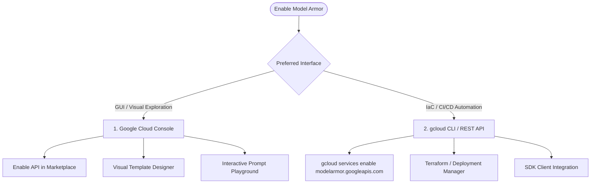

# About setup

**Platform:** Google Cloud Console / Model Armor Enablement & IAM Architecture

---

## Learning Objectives

By the end of this lesson, you will be able to:

- Compare the two primary enablement pathways for Model Armor: Cloud Console vs Google Cloud CLI/API.
- Identify core API dependencies including `modelarmor.googleapis.com` and `dlp.googleapis.com`.
- Implement least-privilege IAM role bindings using the pre-defined Model Armor security roles.
- Formulate a role-based access control (RBAC) matrix for security administrators, application developers, and service accounts.

---

## Enablement Options: Choose Your Pathway

Now that you understand the architectural concepts of Model Armor (Floor Settings, Templates, and Detection Engines), it is time to enable and operationalize the service.

Google Cloud provides two distinct enablement paths depending on your role and workflow:



---

## Service Prerequisites & API Activation

Before configuring templates or screening prompts, ensure the necessary foundational APIs are enabled in your target Google Cloud project:

```bash
# Enable Model Armor API
gcloud services enable modelarmor.googleapis.com

# Enable Cloud Data Loss Prevention (required for custom SDP inspection & masking)
gcloud services enable dlp.googleapis.com

# Enable Cloud Logging (for audit and telemetry logs)
gcloud services enable logging.googleapis.com
```

---

## Identity & Access Management (IAM) Roles

Model Armor enforces strict role-based access control. Assign pre-defined IAM roles following the principle of least privilege:

| Pre-defined IAM Role | Role Title | Key Permissions | Target Persona |
| :--- | :--- | :--- | :--- |
| `roles/modelarmor.admin` | **Model Armor Administrator** | Full administrative control: Create, modify, delete floor settings and templates; view audit logs. | Cloud Security Architects, CISO Team Leads |
| `roles/modelarmor.editor` | **Model Armor Editor** | Create and edit templates; view floor settings. Cannot alter organizational floor settings. | AI Platform Engineers, DevOps Leads |
| `roles/modelarmor.viewer` | **Model Armor Viewer** | Read-only inspection of templates, floor settings, and configuration parameters. | Security Auditors, Compliance Officers |
| `roles/modelarmor.user` | **Model Armor User** | Execute prompt and response sanitization calls (`modelarmor.templates.sanitizeUserPrompt`). | Application Service Accounts, Client SDK runtimes |

### Example: Binding the User Role to an Application Service Account

```bash
gcloud projects add-iam-policy-binding PROJECT_ID \
    --member="serviceAccount:gemini-agent-sa@PROJECT_ID.iam.gserviceaccount.com" \
    --role="roles/modelarmor.user"
```

> [!NOTE]
> If your Model Armor templates incorporate advanced Sensitive Data Protection (SDP) inspect or de-identify templates, the Model Armor service agent (`service-<project-number>@gcp-sa-modelarmor.iam.gserviceaccount.com`) must also be granted `roles/dlp.user` on the DLP templates.
