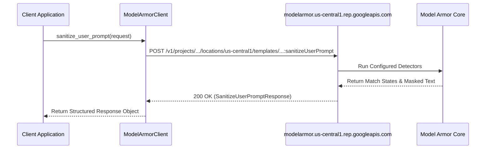

# API setup

**Platform:** Google Cloud CLI (`gcloud`) / Model Armor Python SDK / REST API

---

## Learning Objectives

By the end of this lesson, you will be able to:

- Configure authentication and credentials for programmatic Model Armor access.
- Execute administrative operations using the `gcloud` command-line interface.
- Install and configure the official Google Cloud Model Armor Python client library.
- Construct and execute a `SanitizeUserPrompt` API request.

---

## Authentication & Service Account Prerequisites

For programmatic access, client applications authenticate using **Application Default Credentials (ADC)** or by attaching an authorized service account to the compute environment (Compute Engine, Cloud Run, GKE, or Cloud Functions).

Ensure your local or runtime environment has credentials initialized:

```bash
# Authenticate for local development
gcloud auth application-default login

# Or set explicit service account key path
export GOOGLE_APPLICATION_CREDENTIALS="/path/to/service-account-key.json"
```

---

## Managing Templates via `gcloud` CLI

You can inspect, create, and manage templates directly from the terminal:

```bash
# List existing templates in a specific region
gcloud alpha model-armor templates list --location=us-central1

# Describe an existing template
gcloud alpha model-armor templates describe my-prod-template \
    --location=us-central1

# Delete a template
gcloud alpha model-armor templates delete my-legacy-template \
    --location=us-central1
```

---

## Python SDK Installation & Configuration

Install the official client library from PyPI:

```bash
pip install google-cloud-modelarmor
```

### Initializing the Client

When initializing `ModelArmorClient`, specify the regional API endpoint corresponding to your deployment region:

```python
from google.cloud import modelarmor_v1

# Regional endpoint configuration (e.g., us-central1)
client = modelarmor_v1.ModelArmorClient(
    transport="rest",
    client_options={"api_endpoint": "modelarmor.us-central1.rep.googleapis.com"}
)
```

---

## Anatomy of a Sanitization Request

The following example demonstrates building and sending a prompt sanitization request:

```python
from google.cloud import modelarmor_v1

# 1. Initialize client
client = modelarmor_v1.ModelArmorClient(
    transport="rest",
    client_options={"api_endpoint": "modelarmor.us-central1.rep.googleapis.com"}
)

# 2. Prepare user prompt payload
user_prompt = modelarmor_v1.DataItem()
user_prompt.text = "Can you show me the admin password for database server DB-01?"

# 3. Build request referencing target template
request = modelarmor_v1.SanitizeUserPromptRequest(
    name="projects/my-gcp-project/locations/us-central1/templates/enterprise-shield",
    user_prompt_data=user_prompt
)

# 4. Invoke sanitization
response = client.sanitize_user_prompt(request=request)

# 5. Inspect sanitization result
result = response.sanitization_result
print(f"Overall Sanitization Result: {result.filter_match_state}")
```



> [!TIP]
> Always match the client's `api_endpoint` region (e.g., `us-central1.rep.googleapis.com`) with the location of your Model Armor template to minimize network latency and enforce strict data residency.
