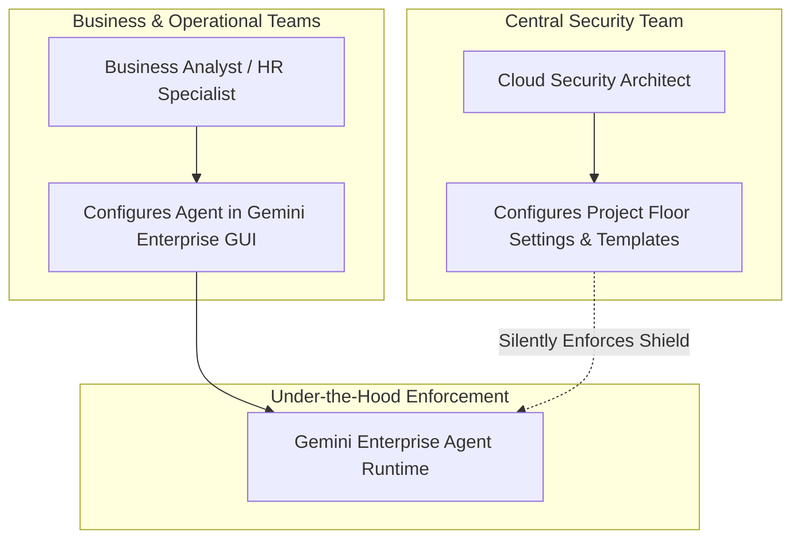

# No-code protections

**Platform:** Gemini Enterprise Agent Platform / Model Armor Console Enforcement

---

## Learning Objectives

By the end of this lesson, you will be able to:

- Secure Gemini Enterprise and intelligent business agents without writing application wrappers.
- Evaluate the strategic trade-offs of the six critical enterprise AI design decisions.
- Formulate a failure mode strategy balancing security (fail-closed) vs uptime (fail-open).
- Configure modality and document screening policies for multimodal agent interactions.

---

## Securing Business Tools Without Custom Wrappers

In many enterprises, business teams, HR personnel, and customer service departments deploy agents directly through the **Gemini Enterprise Agent Platform** graphical interface.

Forcing non-technical business teams to build backend code wrappers or manage SDK dependencies introduces friction and invites security oversights. Model Armor resolves this by enabling **No-Code Inline Protections**:

---

## The Six Critical Design Decisions

When deploying no-code protections for Gemini Enterprise, architects must evaluate six strategic operational decisions:

| Design Decision Area | Option A: Conservative / Strict | Option B: Permissive / Resilient | Recommended Enterprise Practice |
| :--- | :--- | :--- | :--- |
| **1. Enforcement Mode** | **Active Mode:** Automatically blocks offending prompts and responses at the gateway. | **Passive / Audit Mode:** Inspects traffic and logs violations without blocking user queries. | Begin in **Passive Mode** during staging to baseline false positives; promote to **Active Mode** for production. |
| **2. Reliability Dilemma** | **Fail-Closed (Strict Block):** If Model Armor is unreachable, reject all agent queries. | **Fail-Open (Pass-Through):** If Model Armor is unreachable, allow traffic to flow uninspected. | **Fail-Closed** for regulated/customer data; **Fail-Open** for low-risk internal search tools. |
| **3. Strict SDP Behavior** | **Block Entire Query:** Rejects the entire prompt if any sensitive data is discovered. | **Mask Sensitive Entities:** Masks PII with placeholder tokens and proceeds with inference. | **Mask Entities** for support chats; **Block Query** for financial and API credentials. |
| **4. Logging & Privacy** | **Verbose Payload Logging:** Logs entire prompt and response strings for SOC forensic audit. | **Metadata-Only Logging:** Logs detector matches, confidence scores, and principal IDs without text. | **Metadata-Only** to prevent Cloud Logging from becoming a secondary repository of sensitive customer data! |
| **5. Regional Alignment** | **Strict Regional Pinning:** Template, Agent, and Model reside in identical GCP region. | **Cross-Region Replication:** Leverages multi-region endpoints for high availability. | **Strict Regional Pinning** to satisfy GDPR, HIPAA, and regional data sovereignty mandates. |
| **6. Modality Screening** | **Multimodal Screening:** Inspects both text queries and uploaded documents (PDFs, images). | **Text-Only Screening:** Only screens typed textual conversational turns. | **Multimodal Screening** to prevent indirect prompt injection hidden inside uploaded files or resumes. |

---

## Knowledge Check: No-Code Security

| Question / Card Front | Answer / Card Back | Strategic Insight |
| :--- | :--- | :--- |
| *True or False:* If an SDP template detects a violation under `INSPECT_ONLY` mode, the prompt is automatically masked. | **False** | Under `INSPECT_ONLY`, Model Armor logs that a violation occurred but does **not** mask the text. Masking requires pairing with a `DEIDENTIFY` template. |
| *True or False:* To minimize privacy compliance risks, security teams should enable Verbose Payload Logging in production. | **False** | Verbose payload logging records raw prompt text into Cloud Logging, creating a secondary privacy risk. Use **Metadata-Only** logging in production. |
