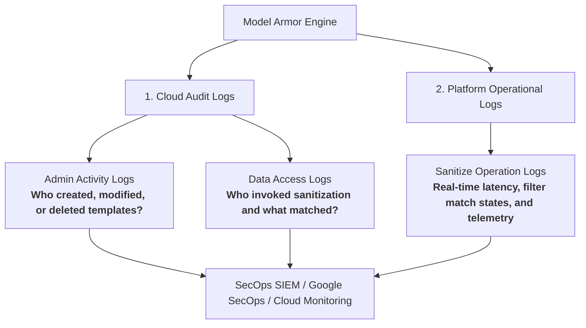
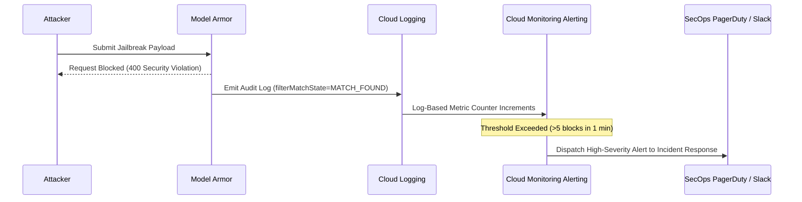

# Flagged violations

**Platform:** Google Cloud Logging / Cloud Monitoring / Security Incident Forensics

---

## Learning Objectives

By the end of this lesson, you will be able to:

- Differentiate between **Cloud Audit Logs** (Admin Activity vs Data Access) and **Platform Logs**.
- Construct precise Logs Explorer queries to isolate Model Armor security events and blocked queries.
- Deconstruct structured JSON audit log payloads to identify threat categories, principal emails, and template IDs.
- Establish automated alerting policies in Cloud Monitoring for rapid SecOps response.

---

## The Model Armor Logging Taxonomy

Model Armor is an enterprise multitasker: while it actively screens prompt streams in milliseconds, it simultaneously produces rich telemetry across two primary log families:



---

## Locating Events in Cloud Logging Logs Explorer

Use these structured queries in the Logs Explorer to isolate Model Armor security telemetry:

### 1. View All Model Armor Events

```sql
resource.type="audited_resource"
protoPayload.serviceName="modelarmor.googleapis.com"
```

### 2. Isolate Prompt Sanitization Operations

```sql
resource.type="audited_resource"
protoPayload.serviceName="modelarmor.googleapis.com"
protoPayload.methodName="google.cloud.modelarmor.v1.ModelArmor.SanitizeUserPrompt"
```

### 3. Filter for Detected Security Violations

```sql
resource.type="audited_resource"
protoPayload.serviceName="modelarmor.googleapis.com"
protoPayload.response.sanitizationResult.filterMatchState="MATCH_FOUND"
```

---

## Dissecting Structured Audit Log Payloads

### Example 1: Admin Activity Audit Log (Template Created)

When a template is created or updated, Cloud Audit Logs captures the administrative event:

```json
{
  "protoPayload": {
    "@type": "type.googleapis.com/google.cloud.audit.AuditLog",
    "authenticationInfo": {
      "principalEmail": "secops-admin@enterprise.com"
    },
    "serviceName": "modelarmor.googleapis.com",
    "methodName": "google.cloud.modelarmor.v1.ModelArmor.CreateTemplate",
    "resourceName": "projects/prod-ai/locations/us-central1/templates/customer-shield",
    "request": {
      "templateId": "customer-shield",
      "template": {
        "filterConfig": {
          "piAndJailbreakFilterSettings": {
            "enforcement": "ENABLED",
            "confidenceLevel": "MEDIUM_AND_ABOVE"
          }
        }
      }
    }
  },
  "severity": "NOTICE"
}
```

### Example 2: Data Access Log (Violation Flagged)

When a user prompt triggers a detector, the log details the match without leaking sensitive prompt contents:

```json
{
  "protoPayload": {
    "@type": "type.googleapis.com/google.cloud.audit.AuditLog",
    "authenticationInfo": {
      "principalEmail": "customer-support-app@prod-ai.iam.gserviceaccount.com"
    },
    "serviceName": "modelarmor.googleapis.com",
    "methodName": "google.cloud.modelarmor.v1.ModelArmor.SanitizeUserPrompt",
    "response": {
      "@type": "type.googleapis.com/google.cloud.modelarmor.v1.SanitizeUserPromptResponse",
      "sanitizationResult": {
        "filterMatchState": "MATCH_FOUND",
        "filterResults": {
          "pi_and_jailbreak": {
            "piAndJailbreakFilterResult": {
              "matchState": "MATCH_FOUND"
            }
          }
        }
      }
    }
  },
  "severity": "WARNING"
}
```

---

## Automated Alerting & SOC Escalation



> [!TIP]
> Create a **Log-Based Metric** in Cloud Monitoring that counts entries where `filterMatchState="MATCH_FOUND"`. You can then configure alerting policies to immediately notify your SOC when a sudden spike in prompt injection attempts occurs!
