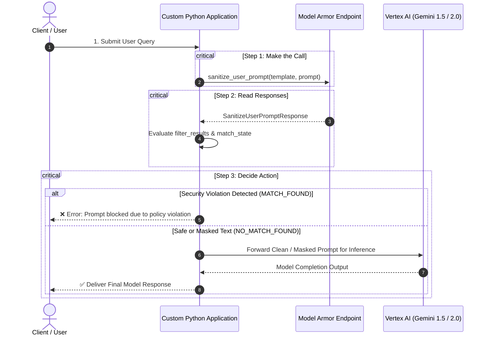

# Application code

**Platform:** Python / Google Cloud Model Armor SDK / Vertex AI Gemini Client

---

## Learning Objectives

By the end of this lesson, you will be able to:

- Implement the complete three-step application pattern: **Make the Call**, **Read Responses**, and **Decide Action**.
- Integrate Model Armor prompt sanitization into custom Python application workflows.
- Inspect `FilterMatchState` across individual filter categories in the sanitization response object.
- Safely orchestrate prompt forwarding to Vertex AI Gemini upon passing security inspection.

---

## The Three-Step Application Pattern

Model Armor performs the heavy lifting of semantic screening, but your application runtime holds the baton. When building custom AI applications, follow this three-step orchestration pattern:



---

## Production Python Implementation

Below is a complete, production-ready Python application demonstrating how to sanitize user input with Model Armor before sending it to a foundation model:

```python
#!/usr/bin/env python3
'''
Production Application Example: Model Armor Prompt Sanitization
Integrates Google Cloud Model Armor with Vertex AI Gemini inference.
'''

import sys
from google.cloud import modelarmor_v1

def run_secure_inference(project_id: str, location: str, template_id: str, prompt_text: str):
    # 1. Initialize the Model Armor Client with regional endpoint
    client = modelarmor_v1.ModelArmorClient(
        transport="rest",
        client_options={"api_endpoint": f"modelarmor.{location}.rep.googleapis.com"}
    )

    # 2. Package prompt data into Model Armor DataItem
    user_prompt_data = modelarmor_v1.DataItem()
    user_prompt_data.text = prompt_text

    # 3. Construct the sanitization request referencing target template
    template_resource_name = f"projects/{project_id}/locations/{location}/templates/{template_id}"
    request = modelarmor_v1.SanitizeUserPromptRequest(
        name=template_resource_name,
        user_prompt_data=user_prompt_data,
    )

    print(f"[*] Dispatching prompt to Model Armor template: {template_id}...")
    response = client.sanitize_user_prompt(request=request)
    result = response.sanitization_result

    # 4. Step 2 & 3: Parse results and decide action
    pijb_match = False
    sdp_match = False
    rai_match = False

    # Check Prompt Injection and Jailbreak match state
    if "pi_and_jailbreak" in result.filter_results:
        pijb_result = result.filter_results["pi_and_jailbreak"].pi_and_jailbreak_filter_result
        if pijb_result.match_state == modelarmor_v1.FilterMatchState.MATCH_FOUND:
            pijb_match = True

    # Check Sensitive Data Protection match state
    if "sensitive_data_protection" in result.filter_results:
        sdp_result = result.filter_results["sensitive_data_protection"].sensitive_data_protection_filter_result
        if sdp_result.match_state == modelarmor_v1.FilterMatchState.MATCH_FOUND:
            sdp_match = True

    # Check Responsible AI match state
    if "responsible_ai" in result.filter_results:
        rai_result = result.filter_results["responsible_ai"].responsible_ai_filter_result
        if rai_result.match_state == modelarmor_v1.FilterMatchState.MATCH_FOUND:
            rai_match = True

    # 5. Enforce Security Decision
    if pijb_match:
        print("[!] SECURITY ALERT: Prompt Injection or Jailbreak detected! Halting execution.")
        return {"status": "BLOCKED", "reason": "PROMPT_INJECTION"}

    if rai_match:
        print("[!] SECURITY ALERT: Responsible AI violation detected! Halting execution.")
        return {"status": "BLOCKED", "reason": "RESPONSIBLE_AI_VIOLATION"}

    # Use sanitized/masked text if sensitive data was transformed
    sanitized_prompt = user_prompt_data.text
    if sdp_match and result.sanitized_item and result.sanitized_item.text:
        sanitized_prompt = result.sanitized_item.text
        print(f"[*] Sensitive data masked: '{sanitized_prompt}'")

    print("[+] Prompt approved by Model Armor. Forwarding to LLM for inference...")
    # --- Simulated LLM Call ---
    # response = vertex_gemini_client.generate_content(sanitized_prompt)
    print(f"[+] LLM Generation Successful for query: '{sanitized_prompt[:40]}...'")
    return {"status": "SUCCESS", "sanitized_prompt": sanitized_prompt}

if __name__ == "__main__":
    PROJECT = "csa-model-armor-demo-012346"
    LOCATION = "us-central1"
    TEMPLATE = "pijb-only"

    # Read prompt from CLI or fallback
    prompt_input = sys.argv[1] if len(sys.argv) > 1 else "Explain quantum computing in one sentence."
    run_secure_inference(PROJECT, LOCATION, TEMPLATE, prompt_input)
```

---

## Architectural Best Practices for Application Developers

1. **Regional Endpoint Alignment:** Always specify `modelarmor.<location>.rep.googleapis.com` matching your template location to minimize round-trip latency.
2. **Handle Masked Text Correctly:** Check `result.sanitized_item.text`. If sensitive data was detected and de-identified, forward the **sanitized** text to the model, not the original raw string!
3. **Log Sanitization Metadata, Not Raw Prompts:** Record the `SanitizeUserPromptResponse` filter match states in your application telemetry to detect coordinated attack campaigns.

> [!IMPORTANT]
> Always pair prompt sanitization with response sanitization (`client.sanitize_model_response`) to ensure the foundation model does not hallucinate sensitive data or return dangerous content to the end user.
