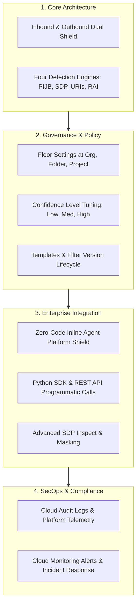

# What did I learn?

**Platform:** Google Cloud Model Armor / Course Completion & Knowledge Synthesis

---

## Course Summary & Congratulations!

Congratulations on completing **Model Armor: Securing AI Deployments**!

You now possess the foundational and practical knowledge necessary to architect, deploy, customize, and monitor enterprise security guardrails for Generative AI applications and Gemini Enterprise intelligent agents.

---

## Comprehensive Enterprise Skills Checklist

Review the core competencies mastered across this course:

| Competency Area | Technical Skill / Capability | Verified in Module |
| :--- | :--- | :--- |
| **Architectural Fundamentals** | Deconstruct the dual-phase (prompt & response) inspection lifecycle and explain Model Armor's role in the enterprise security perimeter. | **Module 01 & 02** |
| **Risk Governance** | Align AI defenses with the OWASP Top 10 for Large Language Models and distinguish between direct and indirect prompt injection attacks. | **Module 02** |
| **Policy Hierarchy** | Establish mandatory, non-negotiable floor settings across Organization, Folder, and Project scopes that developers cannot loosen. | **Module 03** |
| **Classifier Calibration** | Tune confidence level thresholds (`Low`, `Medium`, `High and above`) to balance threat mitigation against false-positive business disruption. | **Module 03** |
| **Template Engineering** | Design reusable security templates, manage the filter version lifecycle (`Latest`, `Stable`), and implement custom data masking with Cloud DLP. | **Module 03** |
| **Zero-Code Agent Defense** | Deploy inline protections for Gemini Enterprise Agent Platform to protect business agents without custom code wrappers. | **Module 03 & 04** |
| **Programmatic Integration** | Implement the Python Model Armor SDK (`google-cloud-modelarmor`) to sanitize prompts, parse match states, and orchestrate LLM inference. | **Module 04 & 05** |
| **SecOps & Auditability** | Query Cloud Logging Logs Explorer for Model Armor audit events, inspect structured JSON payloads, and configure automated alerting policies. | **Module 04** |

---

## Next Steps in Your Enterprise AI Journey

Now that you have mastered Model Armor, continue advancing your enterprise deployment skills across related domains:

- **Identity & Access Management:** Deepen your authentication architecture with [03 - Use a Third-Party Identity Provider with Workforce Identity Federation](file:///home/mudit_singal/Documents/Learning%20-%20GCP%20Prepare%20and%20Deliver%20Gemini%20Enterprise%20Deployments/03%20-%20Use%20a%20Third-Party%20Identity%20Provider%20with%20Workforce%20Identity%20Federation).
- **Search & Retrieval Tuning:** Refine grounded agent knowledge stores with [04 - Improve Agent Search Results on Agent Platform](file:///home/mudit_singal/Documents/Learning%20-%20GCP%20Prepare%20and%20Deliver%20Gemini%20Enterprise%20Deployments/04%20-%20Improve%20Agent%20Search%20Results%20on%20Agent%20Platform).
- **Full Platform Rollout:** Coordinate enterprise-wide transformation with [02 - Deploy the Gemini Enterprise app to Transform Enterprises](file:///home/mudit_singal/Documents/Learning%20-%20GCP%20Prepare%20and%20Deliver%20Gemini%20Enterprise%20Deployments/02%20-%20Deploy%20the%20Gemini%20Enterprise%20app%20to%20Transform%20Enterprises).

> [!NOTE]
> **Now... go protect those agents!** Deploy Model Armor floor settings today and build an impenetrable defense-in-depth perimeter for your enterprise AI ecosystem.
