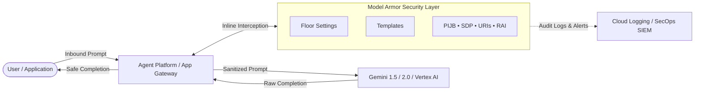

# 05 - Model Armor: Securing AI Deployments

Welcome to the comprehensive technical curriculum for **Model Armor: Securing AI Deployments**, part of the **GCP Prepare and Deliver Gemini Enterprise Deployments** learning path.

This course equips Cloud Security Architects, AI Platform Engineers, and Enterprise IT Administrators with the expertise required to establish a defense-in-depth security perimeter for Generative AI applications and Gemini Enterprise intelligent agents.

---

## Architecture Overview

Google Cloud Model Armor decouples security policy enforcement from model inference, screening both inbound prompts and outbound model completions:

---

## Course Curriculum & Syllabus

The curriculum is organized into **6 Modules** comprising **15 technical lessons**:

### [01 - Course Overview](./01_Course_Overview)
* [01 - What's in it for me?](./01_Course_Overview/01%20-%20What's%20in%20it%20for%20me?.md) — Core value proposition, threat landscape, and learning roadmap. *(Video: [fH62NUGwsyo](https://youtu.be/fH62NUGwsyo))*

### [02 - Model Armor Overview](./02_Model_Armor_Overview)
* [01 - About Model Armor](./02_Model_Armor_Overview/01%20-%20About%20Model%20Armor.md) — Architectural deconstruction, dual-phase sanitization, and live attack demo. *(Videos: [mzXFjFTAIN4](https://youtu.be/mzXFjFTAIN4), [AcZqr7_DA0o](https://youtu.be/AcZqr7_DA0o))*
* [02 - Governing LLM risks](./02_Model_Armor_Overview/02%20-%20Governing%20LLM%20risks.md) — OWASP Top 10 for LLMs, direct vs indirect prompt injection, and Cloud DLP threat matrix. *(Video: [zviPaxJDlu4](https://youtu.be/zviPaxJDlu4))*

### [03 - Customize Model Armor](./03_Customize_Model_Armor)
* [01 - About customization](./03_Customize_Model_Armor/01%20-%20About%20customization.md) — Strategic customization philosophy, Floor Settings vs Templates.
* [02 - Floor settings](./03_Customize_Model_Armor/02%20-%20Floor%20settings.md) — Organization, Folder, and Project baselines, inheritance, and change rules. *(Video: [y7A3eZ2d9AE](https://youtu.be/y7A3eZ2d9AE))*
* [03 - Guard rails and confidence levels](./03_Customize_Model_Armor/03%20-%20Guard%20rails%20and%20confidence%20levels.md) — Confidence scoring, Low/Medium/High thresholds, and false positive trade-offs.
* [04 - Gemini Enterprise Agent Platform integration](./03_Customize_Model_Armor/04%20-%20Gemini%20Enterprise%20Agent%20Platform%20integration.md) — Inline zero-code enforcement, fail-closed vs fail-open modes, and SecOps response.
* [05 - Templates](./03_Customize_Model_Armor/05%20-%20Templates.md) — Template anatomy, filter version lifecycle (`Latest`/`Stable`), and advanced SDP masking. *(Video: [5hf2ygzXKzc](https://youtu.be/5hf2ygzXKzc))*

### [04 - Use Model Armor](./04_Use_Model_Armor)
* [01 - About setup](./04_Use_Model_Armor/01%20-%20About%20setup.md) — Console vs API enablement, service dependencies, and IAM roles.
* [02 - API setup](./04_Use_Model_Armor/02%20-%20API%20setup.md) — `gcloud` CLI commands, Python SDK (`google-cloud-modelarmor`), and REST requests.
* [03 - No-code protections](./04_Use_Model_Armor/03%20-%20No-code%20protections.md) — The six critical design decisions for securing business tools without custom wrappers.
* [04 - Flagged violations](./04_Use_Model_Armor/04%20-%20Flagged%20violations.md) — Cloud Audit Logs vs Platform Logs, Logs Explorer queries, and Cloud Monitoring alert policies.

### [05 - Put it all Together](./05_Put_it_all_Together)
* [01 - Prompts and responses](./05_Put_it_all_Together/01%20-%20Prompts%20and%20responses.md) — Interactive testing playground walkthrough and hands-on lab steps. *(Video: [4FbsGj5MBNk](https://youtu.be/4FbsGj5MBNk))*
* [02 - Application code](./05_Put_it_all_Together/02%20-%20Application%20code.md) — Production Python implementation: sanitize prompt, evaluate match state, and execute inference.

### [06 - Course Conclusion](./06_Course_Conclusion)
* [01 - What did I learn?](./06_Course_Conclusion/01%20-%20What%20did%20I%20learn?.md) — Course synthesis, comprehensive enterprise skills checklist, and certification paths.

---

## Core Technological Artifacts

- **SDK Package:** `google-cloud-modelarmor`
- **Primary APIs:** `modelarmor.googleapis.com`, `dlp.googleapis.com`, `logging.googleapis.com`
- **Supported Integrations:** Gemini Enterprise Agent Platform, Vertex AI, Custom Applications via REST/gRPC
