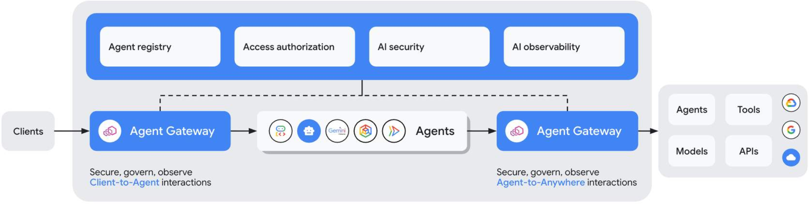

# Dual access paths (Ingress & egress)

In this lesson, you'll learn about the dual access paths managed by the [Agent Gateway](https://docs.cloud.google.com/gemini-enterprise-agent-platform/govern/gateways/agent-gateway-overview): Ingress and Egress.

Many developers confuse the security patterns needed for external clients contacting an agent with those needed for an agent connecting to internal tools.

By successfully configuring both paths, you will ensure complete zero-trust isolation.

You'll learn to secure the ingress boundary to prevent unauthorized users from prompting your agents, while simultaneously restricting the egress boundary so your agents can only call pre-approved enterprise services.

## Deployment modes

Agent Gateway is a networking abstraction that lets you define rules for agent communication and enforces safety, security, and access control policies, without requiring you to manage complex networking details.

Agent Gateway facilitates two primary governed access paths: **Client-to-Agent** interactions and **Agent-to-Anywhere** interactions.

*Agent Gateway modes of operation*

## Client-to-agent (Ingress) security

The **Ingress Access Path** governs how external clients, developer workspaces, or the Gemini Enterprise web application communicate with agents running on Google Cloud's [Agent Runtime](https://docs.cloud.google.com/gemini-enterprise-agent-platform/build/runtime).

### Purpose

Protects the agent runtime execution environment from unauthorized invocation, prompt manipulation, or denial-of-service attacks.

### Enforcement

Ingress is secured by Identity-Aware Proxy (IAP). When a client sends an execution request, IAP intercepts the connection, validates the user's Google credentials, checks their organizational role, and passes a cryptographically signed OIDC token (an ID token) to the Agent Runtime.

### Auditing

All ingress traffic is logged using standard Cloud Audit Logs, showing exactly which enterprise user triggered which agent runtime session.

## Agent-to-anywhere (Egress) security

The **Egress Access Path** governs how the agent communicates with internal tools, Google Cloud APIs, or third-party APIs once it is running.

### Purpose

Controls tool calling, prevents data exfiltration, and enforces least-privilege access to enterprise data.

### Enforcement

Rather than using the agent runtime's default egress route (which typically goes over the public internet), you bind the runtime to the [Agent Gateway](https://docs.cloud.google.com/gemini-enterprise-agent-platform/govern/gateways/agent-gateway-overview) using a regional **Network Attachment**. All tool execution calls are directed to the gateway, which resolves names using dedicated split-horizon DNS peering and forwards traffic through Private Service Connect (PSC) Interfaces to internal resources.

### Isolation

This ensures that agents running in the cloud have zero direct routing to the public internet and can only reach destinations explicitly cataloged in the [Agent Registry](https://docs.cloud.google.com/agent-registry/overview).

> [!Warning]
>
> Never allow agents executing on [Agent Runtime](https://docs.cloud.google.com/gemini-enterprise-agent-platform/build/runtime) to access standard public internet egress if they handle sensitive enterprise databases.
>
> A compromised or manipulated agent can easily exfiltrate scanned data by writing it to an external public endpoint if the egress route is not restricted through the [Agent Gateway](https://docs.cloud.google.com/gemini-enterprise-agent-platform/govern/gateways/agent-gateway-overview).
