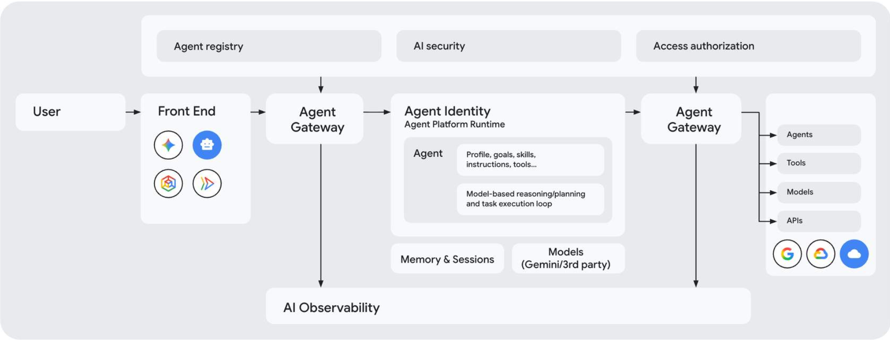

# Agent Gateway architecture integrated with access policies

In this lesson, you'll learn about the core architecture of the [Agent Gateway](https://docs.cloud.google.com/gemini-enterprise-agent-platform/govern/gateways/agent-gateway-overview) and how it serves as a centralized policy enforcement point.

Without a unified gateway, security administrators must inspect and protect dozens of individual agent deployments, increasing the risk of configuration drift and security breaches.

By understanding how the [Agent Gateway](https://docs.cloud.google.com/gemini-enterprise-agent-platform/govern/gateways/agent-gateway-overview) integrates with the rest of the [Gemini Enterprise Agent Platform](https://docs.cloud.google.com/gemini-enterprise-agent-platform), you can enforce unified [Agent Policies](https://docs.cloud.google.com/gemini-enterprise-agent-platform/govern/policies/overview), apply content filters, and manage agent connectivity from a single, centralized plane.

This central controls system ensures that no agent can communicate with external tools or internal databases without passing through your organization's security guardrails.

### The centralized gateway architecture

When we show up to the present moment with all of our senses, we invite the world to fill us with joy.

The pains of the past are behind us.

The future has yet to unfold.

But the now is full of beauty simply waiting for our attention.

### The centralized gateway architecture

The [**Agent Gateway**](https://docs.cloud.google.com/gemini-enterprise-agent-platform/govern/gateways/agent-gateway-overview) is the primary networking component of the [Gemini Enterprise Agent Platform](https://docs.cloud.google.com/gemini-enterprise-agent-platform)'s governance suite. It is designed as a highly available, Google-managed regional proxy that sits between your agent runtimes and the tools they need to execute.

*Agent Gateway and Agent Platform ecosystem*

### The centralized gateway architecture

Rather than letting agents directly call public APIs or internal database connectors, all traffic is routed through the gateway.

The gateway acts as a protocol-aware proxy (supporting the Model Context Protocol, or MCP) and performs header inspection, identity verification, and body sanitization instantly.

Click the marker numbers in the diagram to learn more.

> [!NOTE]
> Interactive Element (Type: labeledgraphic) - Review Original Course

### Integrating gateways with access policies

When we show up to the present moment with all of our senses, we invite the world to fill us with joy.

The pains of the past are behind us.

The future has yet to unfold.

But the now is full of beauty simply waiting for our attention.

### Integrating gateways with access policies

The [Agent Gateway](https://docs.cloud.google.com/gemini-enterprise-agent-platform/govern/gateways/agent-gateway-overview) does not make authorization decisions on its own. Instead, it delegates authorization to external **Service Extensions** using **Authorization Policies**.

*The gateway supports two policy profiles. Select the tabs to learn more.*

### REQUEST\_AUTHZ (Request Authorization)

**REQUEST\_AUTHZ** **(Request Authorization):** This extension is evaluated at the HTTP header stage before the request is forwarded. It integrates with Identity-Aware Proxy (IAP) to validate whether the agent's identity holds appropriate permissions to call the specific target endpoint or tool.

### CONTENT\_AUTHZ (Content Authorization)

**CONTENT\_AUTHZ** **(Content Authorization):** This extension streams the request and response bodies to a service extension, typically [Model Armor](https://docs.cloud.google.com/gemini-enterprise-agent-platform/govern/configure-model-armor), to sanitize prompts, detect injection attacks, and block sensitive data leaks.

By separating these concerns into distinct policy profiles, administrators can independently update network access rules and safety templates without disrupting agent operations.

**Google Cloud best practice**  
Always establish separate Service Extensions for request authorization and content screening. This "separation of duties" allows network security teams to manage mTLS and IAM boundaries through the REQUEST\_AUTHZ path, while AI safety and compliance teams manage threat patterns and data loss prevention (DLP) using the CONTENT\_AUTHZ path.
