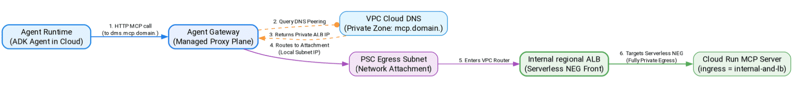

# Private egress primitives (PSC interfaces)

In this lesson, you'll learn how to configure private egress using Private Service Connect (PSC) Interfaces.

Traditional network configurations rely on NAT gateways or public IP addresses, which expose egress traffic to transit risks and routing complexities.

By implementing PSC Interfaces, you will route traffic between the [Agent Gateway](https://docs.cloud.google.com/gemini-enterprise-agent-platform/govern/gateways/agent-gateway-overview) and your private tools entirely within Google Cloud's internal network.

The agent's requests never traverse the public internet, and internal hostnames resolve seamlessly through custom DNS peering configurations.

## Understanding PSC interfaces & network attachments

**Private Service Connect (PSC) Interfaces** allow different VPC networks—such as the Google-managed [Agent Runtime](https://docs.cloud.google.com/gemini-enterprise-agent-platform/build/runtime) network and your corporate VPC—to connect securely without setting up traditional VPC Peering or VPN tunnels.

* **Network Attachment:** A regional resource (e.g., agent-gateway-na) created in your VPC that represents the physical endpoint where the [Agent Gateway](https://docs.cloud.google.com/gemini-enterprise-agent-platform/govern/gateways/agent-gateway-overview)'s egress traffic enters your network.
* **IP Allocation:** The Network Attachment pulls private IP addresses from your dedicated Gateway Egress Subnet. When the [Agent Gateway](https://docs.cloud.google.com/gemini-enterprise-agent-platform/govern/gateways/agent-gateway-overview) forwards an MCP call to an internal tool, the request appears in your VPC as if it originated from one of these local subnet IPs.

## DNS peering and resolution

Because the [Agent Gateway](https://docs.cloud.google.com/gemini-enterprise-agent-platform/govern/gateways/agent-gateway-overview) sits in a managed service project, it cannot naturally resolve private domains (like \*.[mcp.agw.example.com](http://mcp.agw.example.com)) registered inside your VPC. To connect these networks, you configure **DNS Peering**:

* **DNS Peering Config:** You patch the [Agent Gateway](https://docs.cloud.google.com/gemini-enterprise-agent-platform/govern/gateways/agent-gateway-overview)'s network\_config to peer its local DNS zone with your corporate VPC network.
* **Resolution Flow:** When the agent requests a tool at [legacy-dms.mcp.agw.example.com](http://legacy-dms.mcp.agw.example.com), the gateway intercepts the lookup, routes the query to your private Cloud DNS zone using the peered connection, resolves the internal IP address, and sends the payload securely over the PSC network attachment.

> [!WARNING]
>
> Always ensure that all peered domains declared in the dns\_peering\_config end with a trailing dot (e.g., [mcp.agw.example.com](http://mcp.agw.example.com).). Omitting the trailing dot is a common configuration mistake that will cause DNS resolution timeouts inside the [Agent Gateway](https://docs.cloud.google.com/gemini-enterprise-agent-platform/govern/gateways/agent-gateway-overview).
