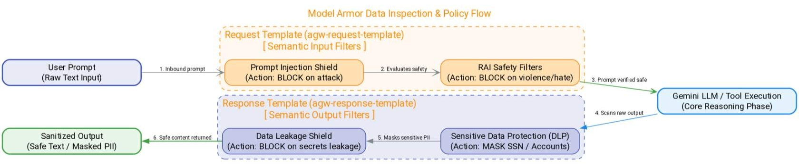

# Content sanitization (CONTENT_AUTHZ using Model Armor)

In this lesson, you'll learn how to implement semantic content security using the CONTENT\_AUTHZ gateway extension.

Traditional applications use static input validation rules, which fail to capture the fluid, unpredictable nature of natural language prompts.

By routing all agent prompts and responses through [**Model Armor**](https://docs.cloud.google.com/gemini-enterprise-agent-platform/govern/configure-model-armor), you will establish a unified safety barrier.

You'll learn how to construct request and response evaluation templates, import them as service extensions, and link them to your [Agent Gateway](https://docs.cloud.google.com/gemini-enterprise-agent-platform/govern/gateways/agent-gateway-overview) to sanitize text interactions instantly.

## The CONTENT\_AUTHZ extension lifecycle

Unlike request authorization which runs once, **CONTENT\_AUTHZ** is a streaming inspection pipeline.

1. **Request Phase:** The user prompts the agent. The prompt body is intercepted by the [Agent Gateway](https://docs.cloud.google.com/gemini-enterprise-agent-platform/govern/gateways/agent-gateway-overview) and streamed to [Model Armor](https://docs.cloud.google.com/gemini-enterprise-agent-platform/govern/configure-model-armor).
2. **Inspection:** [Model Armor](https://docs.cloud.google.com/gemini-enterprise-agent-platform/govern/configure-model-armor) evaluates the text against a pre-configured **Request Template** looking for threats like prompt injections or hate speech.
3. **Blocking/Sanitization:** If a violation is detected, the extension intercepts the request and returns a safe, sanitized response or block notification, preventing the prompt from reaching the LLM.

**Response Phase:** The tool execution output is returned. The gateway streams the response to [Model Armor](https://docs.cloud.google.com/gemini-enterprise-agent-platform/govern/configure-model-armor) to inspect against a **Response Template** (e.g., checking for data leaks or PII) before displaying the final text to the end user.

## Configuring Model Armor templates

You declare [Model Armor](https://docs.cloud.google.com/gemini-enterprise-agent-platform/govern/configure-model-armor) templates as regional resources. Each template defines a list of filters and actions:

In your gateway config, you package these settings in a YAML definition that lists the request and response template paths, then import it as an active authorization extension.

> ## Google Cloud Best Practice
>
> Set your [Model Armor](https://docs.cloud.google.com/gemini-enterprise-agent-platform/govern/configure-model-armor) extension's failOpen configuration to true only during development smoke tests. For production environments handling sensitive data, always set failOpen to false.
>
> This ensures that if the [Model Armor](https://docs.cloud.google.com/gemini-enterprise-agent-platform/govern/configure-model-armor) service experiences a transient outage or timeout, the gateway defaults to blocking the request rather than letting potentially malicious or unmasked data pass through.
