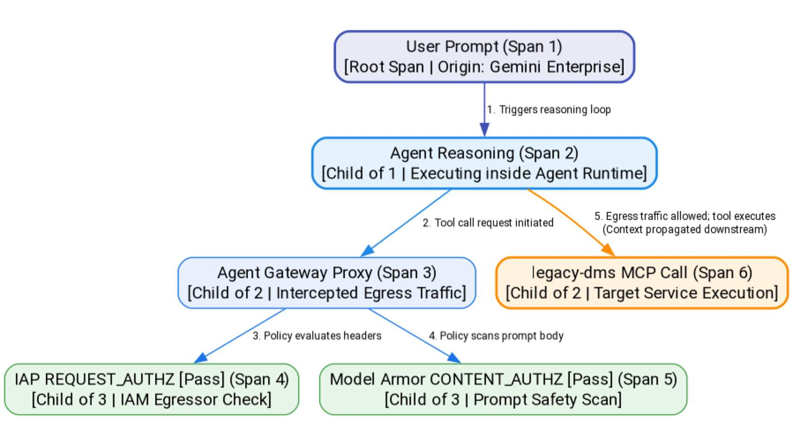

# End-to-end auditing (Cloud trace)

In this lesson, you'll learn how to audit and trace the end-to-end execution of your agent workloads using **Cloud Trace**. When an agent executes a complex task, it runs a multi-step loop that can call several databases, send emails, and pass through multiple security gateways, making traditional logs confusing and difficult to reconstruct.

By implementing distributed tracing with OpenTelemetry, you'll capture a unified visual timeline of every request. You'll learn how to read these traces in Cloud Trace to pinpoint which tool caused a latency spike or which security extension blocked a specific call.

## Distributed tracing with OpenTelemetry

Because the Gemini Enterprise Agent Platform is natively instrumented with OpenTelemetry, it automatically generates tracing spans for every phase of the execution:

* **The Parent Span:** Represents the user's initial prompt (e.g. entering a question in the Gemini Enterprise webapp).
* **The Reasoning Span:** Tracks the agent runtime's internal reasoning loop.
* **The Security Spans:** Captures the [Agent Gateway](https://docs.cloud.google.com/gemini-enterprise-agent-platform/govern/gateways/agent-gateway-overview) interception, the REQUEST\_AUTHZ IAP evaluation time, and the CONTENT\_AUTHZ [Model Armor](https://docs.cloud.google.com/gemini-enterprise-agent-platform/govern/configure-model-armor) scanning duration.

**The Tool Spans:** Records the latency and execution status of each individual MCP server callout.

## Analyzing traces in the Google Cloud console

When troubleshooting or auditing, you open the **Traces** dashboard in the Google Cloud Console.

* **Visual Timeline:** You see a hierarchical waterfall chart showing exactly how long each component took.
* **Policy Inspection:** If an agent call fails with a 403 error, you can examine the specific IAP REQUEST\_AUTHZ span to inspect the evaluation results.
* **Content Safe-Audit:** You can inspect the [Model Armor](https://docs.cloud.google.com/gemini-enterprise-agent-platform/govern/configure-model-armor) spans to see if a request was blocked due to a prompt injection policy violation, showing the specific category that triggered the block.

> ## Google Cloud Best Practice   
>
> Always keep OpenTelemetry tracing active in production runtimes.
>
> The latency overhead is negligible (less than a few milliseconds), while the value of having complete, auditable, and visual execution records for compliance and debugging is invaluable.
